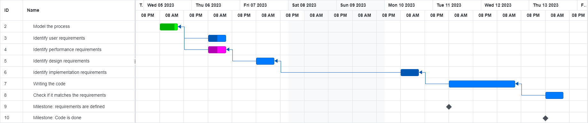

# Project Estimation - CURRENT
Date: 27-04-2023

Version: 1.0

# Estimation approach
Consider the EZWallet  project in CURRENT version (as received by the teachers), assume that you are going to develop the project INDEPENDENT of the deadlines of the course
# Estimate by size
### 
|                                                                                                         | Estimate |             
|---------------------------------------------------------------------------------------------------------|----------|  
| NC =  Estimated number of classes to be developed                                                       | 9        |             
| A = Estimated average size per class, in LOC                                                            | 50       | 
| S = Estimated size of project, in LOC (= NC * A)                                                        | 450      |
| E = Estimated effort, in person hours (here use productivity 10 LOC per person hour)                    | 45       |   
| C = Estimated cost, in euro (here use 1 person hour cost = 30 euro)                                     | 1350     | 
| Estimated calendar time, in calendar weeks (Assume team of 4 people, 8 hours per day, 5 days per week ) | 2 days   |               

# Estimate by product decomposition
### 
| component name       | Estimated effort (person hours) |             
|----------------------|---------------------------------| 
| requirement document | 10                              |
| GUI prototype        | 5                               |
| design document      | 5                               |
| code                 | 15                              |
| unit tests           | 5                               |
| api tests            | 5                               |
| management documents | 5                               |

# Estimate by activity decomposition
### 
| Activity name                        | Estimated effort (person hours) |             
|--------------------------------------|---------------------------------| 
| Model the process                    | 6                               |
| Identify user requirements           | 6                               |
| Identify performance requirements    | 6                               |
| Identify design requirements         | 6                               |
| Identify implementation requirements | 6                               |
| Writing the code                     | 15                              |
| Check if it matches the requirements | 5                               |

###
Insert here Gantt chart with above activities
</img>
# Summary

Report here the results of the three estimation approaches. The  estimates may differ. Discuss here the possible reasons for the difference

|                                    | Estimated effort | Estimated duration |          
|------------------------------------|------------------|--------------------|
| estimate by size                   | 45               | 2 days             |
| estimate by product decomposition  | 50               | 2 days             |
| estimate by activity decomposition | 50               | 2 days             |

the size estimation is based on an average LOC/h of the last projects during the entire lifespan, this one seems more complex and that's why
there is a small gap between the estimations.

