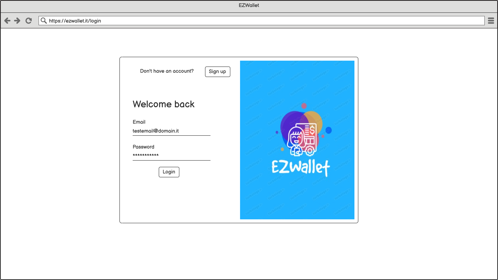
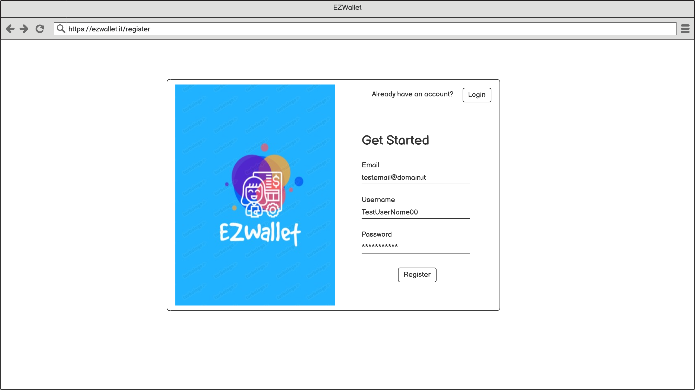
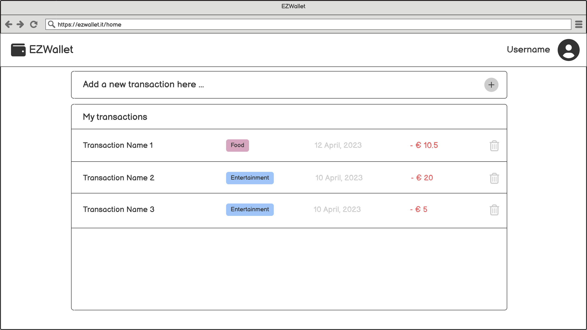

# Graphical User Interface Prototype  - CURRENT

Date: 15/04/2023

Version: 1.0

<figure>
    </img>
    <figcaption align = "center">Fig. 1 - Login</figcaption>
</figure>
  
  
<figure>
    </img>
    <figcaption align = "center">Fig. 2 - Register</figcaption>
</figure>
  
  
<figure>
    </img>
    <figcaption align = "center">Fig. 3 - Homepage</figcaption>
</figure>
  
  
<figure>
    </img>
    <figcaption align = "center">Fig. 4 - Homepage, Add Transaction</figcaption>
</figure>
  

<figure>
    </img>
    <figcaption align = "center">Fig. 5 - Homepage, Categories</figcaption>
</figure>
  

<figure>
    </img>
    <figcaption align = "center">Fig. 6 - Homepage, Delete Transaction</figcaption>
</figure>

<figure>
    </img>
    <figcaption align = "center">Fig. 7 - User page</figcaption>
</figure>