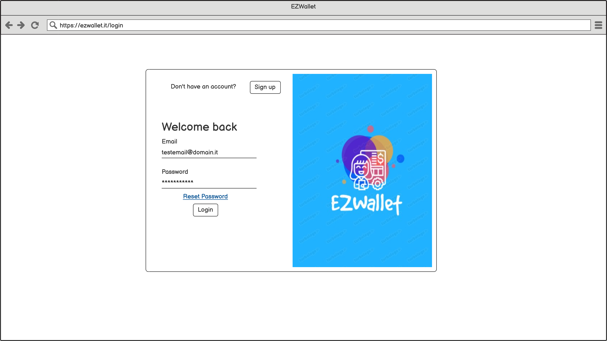
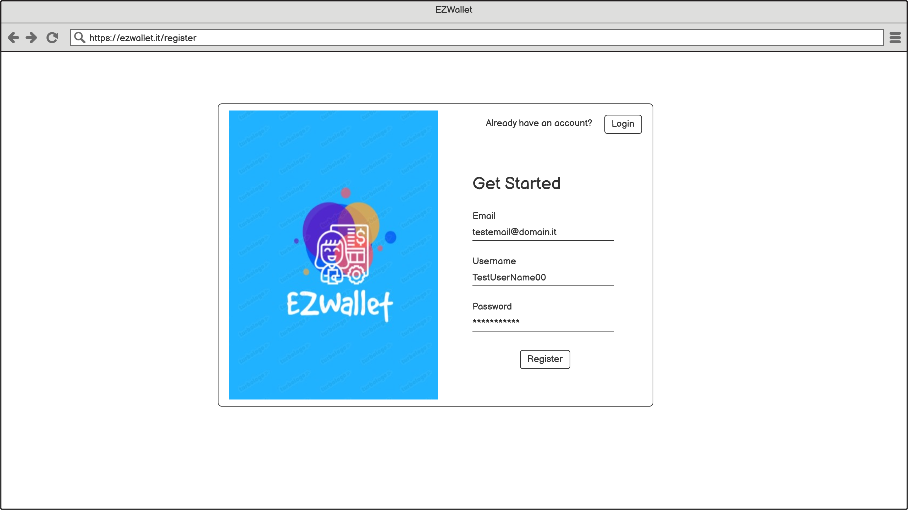
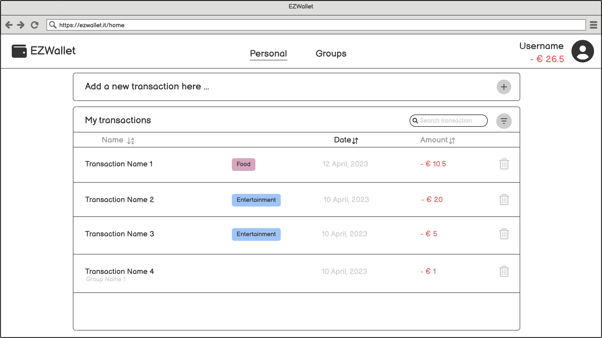

# Graphical User Interface Prototype  - FUTURE

Date: 24/04/2023

Version: 2.4

# Authentication
The Authentication GUI is the same for User and Admin.
<figure>
    </img>
    <figcaption align = "center">Fig. 1 - Login</figcaption>
</figure>
  
  
<figure>
    </img>
    <figcaption align = "center">Fig. 2 - Register</figcaption>
</figure>
  
<figure>
    </img>
    <figcaption align = "center">Fig. 2 - Reset Password</figcaption>
</figure>
  
<figure>
    </img>
    <figcaption align = "center">Fig. 2 - Change Password</figcaption>
</figure>

# Admin
<figure>
    </img>
    <figcaption align = "center">Fig. 1 - Admin Page</figcaption>
</figure>

<figure>
    </img>
    <figcaption align = "center">Fig. 2 - Admin Delete User</figcaption>
</figure>

<figure>
    </img>
    <figcaption align = "center">Fig. 3 - Admin Users Statistics</figcaption>
</figure>

<figure>
    </img>
    <figcaption align = "center">Fig. 4 - Admin Page Advertisements</figcaption>
</figure>

<figure>
    </img>
    <figcaption align = "center">Fig. 5 - Admin Page Survey</figcaption>
</figure>

# User
<figure>
    </img>
    <figcaption align = "center">Fig. 1 - User Homepage</figcaption>
</figure>

<figure>
    </img>
    <figcaption align = "center">Fig. 2 - User Homepage, Advertisement</figcaption>
</figure>

<figure>
    </img>
    <figcaption align = "center">Fig. 3 - User Homepage, Add Transaction</figcaption>
</figure>

<figure>
    </img>
    <figcaption align = "center">Fig. 4 - User Homepage, Filter</figcaption>
</figure>

<figure>
    </img>
    <figcaption align = "center">Fig. 5 - User Homepage, Filter by Category</figcaption>
</figure>

<figure>
    </img>
    <figcaption align = "center">Fig. 6 - User Profile Page</figcaption>
</figure>

<figure>
    </img>
    <figcaption align = "center">Fig. 7 - User Homepage, Groups</figcaption>
</figure>

<figure>
    </img>
    <figcaption align = "center">Fig. 8 - Groups, Group Menu</figcaption>
</figure>

<figure>
    </img>
    <figcaption align = "center">Fig. 9 - Groups, New Group</figcaption>
</figure>

<figure>
    </img>
    <figcaption align = "center">Fig. 10 - Groups, Delete Group</figcaption>
</figure>

<figure>
    </img>
    <figcaption align = "center">Fig. 11 - Groups, Share Link</figcaption>
</figure>

<figure>
    </img>
    <figcaption align = "center">Fig. 12 - Groups, Group Members</figcaption>
</figure>

<figure>
    </img>
    <figcaption align = "center">Fig. 13 - Groups, Remove User</figcaption>
</figure>
