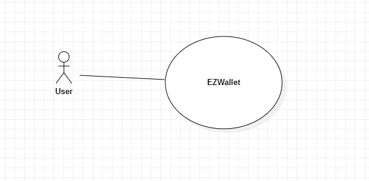
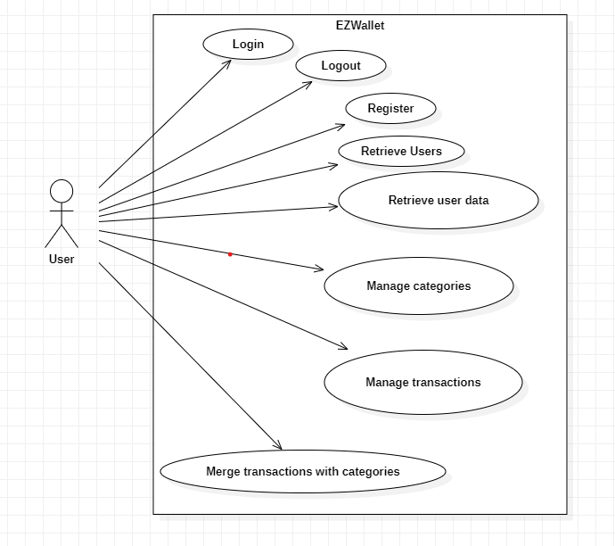
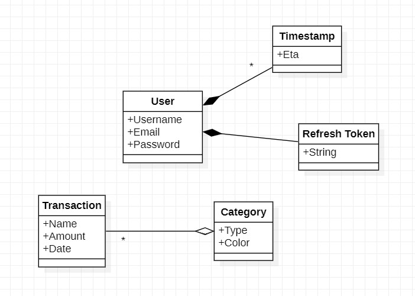
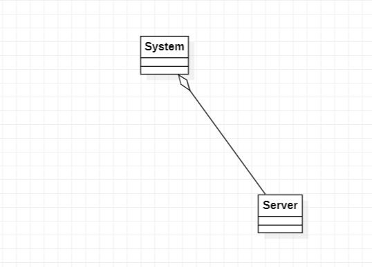
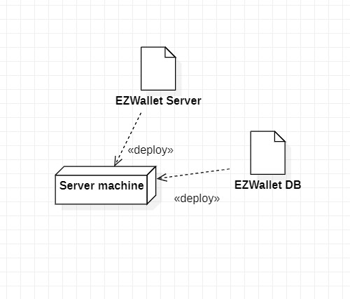

# Requirements Document - current EZWallet

Date: 27-04-2023

Version: V1 - description of EZWallet in CURRENT form (as received by teachers)

 
| Version number | Change                                                                                               |
|----------------|:-----------------------------------------------------------------------------------------------------|
| 1.0            | Defined the stakeholders, the interfaces and some possible stories from reviewing the code           |
| 2.0            | Defined the context diagram, both functional and non functional requirements and the table of rights |
| 3.0            | Defined the use case diagram and the use cases                                                       | 
| 4.0            | Defined the glossary, the system design and the deployment diagram                                   |
| 5.0            | General revision of the document, some fixes and minor additions                                     |

# Contents

- [Informal description](#informal-description)
- [Stakeholders](#stakeholders)
- [Context Diagram and interfaces](#context-diagram-and-interfaces)
	+ [Context Diagram](#context-diagram)
	+ [Interfaces](#interfaces) 
	
- [Stories and personas](#stories-and-personas)
- [Functional and non functional requirements](#functional-and-non-functional-requirements)
	+ [Functional Requirements](#functional-requirements)
	+ [Non functional requirements](#non-functional-requirements)
- [Use case diagram and use cases](#use-case-diagram-and-use-cases)
	+ [Use case diagram](#use-case-diagram)
	+ [Use cases](#use-cases)
    	+ [Relevant scenarios](#relevant-scenarios)
- [Glossary](#glossary)
- [System design](#system-design)
- [Deployment diagram](#deployment-diagram)

# Informal description
EZWallet (read EaSy Wallet) is a software application designed to help individuals and families keep track of their expenses. Users can enter and categorize their expenses, allowing them to quickly see where their money is going. EZWallet is a powerful tool for those looking to take control of their finances and make informed decisions about their spending.

# Stakeholders

| Stakeholder name  |                      Description                      | 
|-------------------|:-----------------------------------------------------:|
| User              |           person that uses the application            |
| Application store | stakeholder in charge of distributing our application |

<!-- | Admin             | person that manages the application | NOT IMPLEMENTED YET-->

# Context Diagram and interfaces
## Context Diagram

</img>

## Interfaces

| Actor | Logical Interface |         Physical Interface |
|-------|:-----------------:|---------------------------:|
| User  |        GUI        | Keyboard,monitor and mouse |

<!--| Admin |        GUI        |         PC | NOT IMPLEMENTED YET-->

# Stories and personas

##### Woman, 40 years old:

She wants to keep track of her expenses, and she uses EZWallet, she adds a category "Bills" and add all her monthly bills to it
as transactions in order to group them together and see how much she spends on bills each month. She then does the same with
her groceries, and her entertainment expenses. She can now see how much she spends on each category and can make informed
decisions about her spending.

##### Out-of-doors university student, 22 years old:

He has a limited budget due to his student status, and he wants to monitor his expenses. He uses EZWallet and adds some categories:
"Food", "Bills", "Rent" and "Other". He adds every transaction he makes to the corresponding category. He can now see how much he
spends on each category, so he can try to stay within his monthly budget.

##### Young couple, 25 years old:

They have lived together for a few months and believe in being financially responsible. EZWallet is their trusted app
to accomplish their vision: they use a shared account to manage their common money. They separate their expenses into categories
to distinguish them better: in this way, they are able to aggregate transactions under categories. Using EZWallet, they can save
money each month and can accumulate it to buy a house.

##### Man, 27 Years old:

He lives alone and as a very busy person he has little time to keep track of his expenses. EZWallet lets him easily add a transaction in just a few seconds.
The transaction will appear in the list of transactions and, eventually, he will be able to easily delete it in no time.
EZWallet is therefore easy to use and doesn't take too much of his time. 

# Functional and non functional requirements

## Functional Requirements

| ID    |            Description             |
|-------|:----------------------------------:| 
| FR1   |       Authentication (OAuth)       |
| FR1.1 |               Login                |
| FR1.2 |               Logout               |
| FR1.3 |              Register              |
| FR1.4 |        Refresh Access Token        |
| FR2   |                User                |
| FR2.1 |         get all the users          | 
| FR2.2 |     get all the data of a user     |
| FR3   |             Categories             |
| FR3.1 |         Create a category          |
| FR3.2 |       get all the categories       |
| FR4   |            Transactions            |
| FR4.1 |        Create a transaction        |
| FR4.2 |      get all the transactions      |
| FR4.3 |        Delete a transaction        |
| FR5   |           Data analysis            |
| FR5.1 | merge categories with transactions |

## Major defects list

| ID                                  |                                                          Description                                                           |
|-------------------------------------|:------------------------------------------------------------------------------------------------------------------------------:|
| Scalability missing                 | there isn't a link between transactions and groups, this doesn't allow having more then one user without having privacy issues |
| admin implementation is missing     |                              there isn't a check for admin functions (like getting all the users)                              |
| getLabel function has some problems |                             the merge isn't done correctly, category's adjectives aren't returned                              |

## Table of access rights

|       | User |
|-------|:----:|
| FR1.1 |  x   |
| FR1.2 |  x   |
| FR1.3 |  x   |
| FR1.4 |  x   |
| FR2.1 |  x   |
| FR2.2 |  x   |
| FR3.1 |  x   |
| FR3.2 |  x   |
| FR4.1 |  x   |
| FR4.2 |  x   |
| FR4.3 |  x   |
| FR5.1 |  x   |

## Non Functional Requirements

| ID   | Type (efficiency, reliability, ..) |                                                     Description                                                     |               Refers to |
|------|:----------------------------------:|:-------------------------------------------------------------------------------------------------------------------:|------------------------:|
| NFR1 |             Usability              | main functions for user designed easy recognizable, the user should need less than 5 minutes to learn how to use it | All the functionalities |
| NFR2 |              Security              |               any unauthorized access restricted immediately, should follow the store security rules                | All the functionalities |
| NFR3 |            Correctness             |                                     Results of the analysis have to be correct                                      |      User,Data Analysis |
| NFR4 |             Efficiency             |                            Results of the analysis have to be displayed within 5 seconds                            |      User,Data Analysis |
| NFR5 |            Availability            |  the application have a maximum amount of 15 minutes of downtime during the day hours and 5 hours during the night  | All the functionalities |

# Use case diagram and use cases

## Use case diagram

</img>

## Use cases

### Login
### Register
### Logout
### Retrieve Users
### Retrieve user data
### Manage categories
### Manage transactions
### Merge categories with transactions

# Relevant scenarios

### Use case 1, Login
##### Scenario 1.1
| Scenario 1.1   |                                     |
|----------------|:-----------------------------------:|
| Precondition   |        user is not logged in        |
| Post condition |          user is logged in          |
| Step#          |             Description             |
| 1              | user enters his email and password  |
| 2              |     user clicks on login button     |
| 3              | user is redirected to his home page |

### Use case 2, Logout
##### Scenario 2.1
| Scenario 2.1   |                                         |
|----------------|:---------------------------------------:|
| Precondition   |            user is logged in            |
| Post condition |          user is not logged in          |
| Step#          |               Description               |
| 1              |      user clicks on logout button       |
| 2              | user is redirected to general main page |

### Use case 3, Register
##### Scenario 3.1
| Scenario 3.1   |                                             |
|----------------|:-------------------------------------------:|
| Precondition   |           user is not registered            |
| Post condition |             user is registered              |
| Step#          |                 Description                 |
| 1              | user enters his email,username and password |
| 2              |       user clicks on register button        |
| 3              |      user is redirected to login page       |

<!-- NO REFRESH TOKEN, IT'S A FUNCTIONAL REQUIREMENT BECAUSE IT NEEDS TO BE DEVELOPED BUT IS NOT A USE CASE (USER IS NOT AWARE OF IT!)-->

### Use case 4, Retrieve user data
#### Scenario 4.1
| Scenario 4.1   |                                       |
|----------------|:-------------------------------------:|
| Precondition   |           user is logged in           |
| Post condition | information about all users retrieved |
| Step#          |              Description              |
| 1              | user looks for all users information  |
| 2              |  user clicks on the "confirm" button  |
| 3              |    request processed by the server    |

### Use case 5, Retrieve Users
#### Scenario 5.1
<!-- THE ADMIN FUNCTION ISN'T IMPLEMENTED YET, BUT THIS WOULD BE A SCENARIO -->
| Scenario 5.1   |                                              |
|----------------|:--------------------------------------------:|
| Precondition   | user is logged in and refresh token is valid |
| Post condition |     information about the user retrieved     |
| Step#          |                 Description                  |
| 1              |    user clicks on the personal area icon     |
| 3              |       the user has the access granted        |

<!--| 2              |     user confirms to be an admin      |-->

### Use case 6, Manage categories
#### Scenario 6.1a
| Scenario 6.1a  |                                                |
|----------------|:----------------------------------------------:|
| Precondition   |         category is not created/added          |
| Post condition |           category is created/added            |
| Step#          |                  Description                   |
| 1              |       user clicks "new category" button.       |
| 2              | user enters type and color of current category |
| 3              |            user clicks enter button            |

#### Scenario 6.1b
| Scenario 6.1b  |                                    |
|----------------|:----------------------------------:|
| Precondition   |   category is not created/added    |
| Post condition |     category is created/added      |
| Step#          |            Description             |
| 1              | user clicks "new category" button. |
| 2              |    user clicks on enter button     |

#### Scenario 6.2
| Scenario 6.2   |                                                   |
|----------------|:-------------------------------------------------:|
| Precondition   |            category list is not shown             |
| Post condition |              category list is shown               |
| Step#          |                    Description                    |
| 1              | user press on the select category dropdown button |
| 2              |          system retrieves all categories          |

### Use case 7, Manage transactions
#### Scenario 7.1
| Scenario 7.1   |                                                                                    |
|----------------|:----------------------------------------------------------------------------------:|
| Precondition   |                              transaction is not added                              |
| Post condition |                                transaction is added                                |
| Step#          |                                    Description                                     |
| 1              |                         user selects "add new transaction"                         |
| 2              |       user enters respectively name, type and amount of the new transaction        |
| 3              |                          user clicks on "confirm" button                           |

#### Scenario 7.2
| Scenario 7.2   |                                   |
|----------------|:---------------------------------:|
| Precondition   |   transaction list is not shown   |
| Post condition |     transaction list is shown     |
| Step#          |            Description            |
| 1              |    user opens the application     |
| 2              | system retrieves all transactions |

#### Scenario 7.3
| Scenario 7.3   |                                              |
|----------------|:--------------------------------------------:|
| Precondition   |          transaction is in the list          |
| Post condition |           transaction was deleted            |
| Step#          |                 Description                  |
| 1              | user hovers on the transaction to be deleted |
| 2              |        user clicks on "delete" button        |
| 3              |  user confirms deletion of the transaction   |

### Use case 8, Merge categories with transactions
#### Scenario 8.1
| Scenario 8.1   |                                                                               |
|----------------|:-----------------------------------------------------------------------------:|
| Precondition   |                               user is logged in                               |
| Post condition |        transactions enriched with their belonging category information        |
| Step#          |                                  Description                                  |
| 1              |                     user displays the transaction section                     |
| 2              | system retrieves all transactions and categories and match them automatically |
# Glossary

</img>

# System Design

</img>

# Deployment Diagram

</img> 

