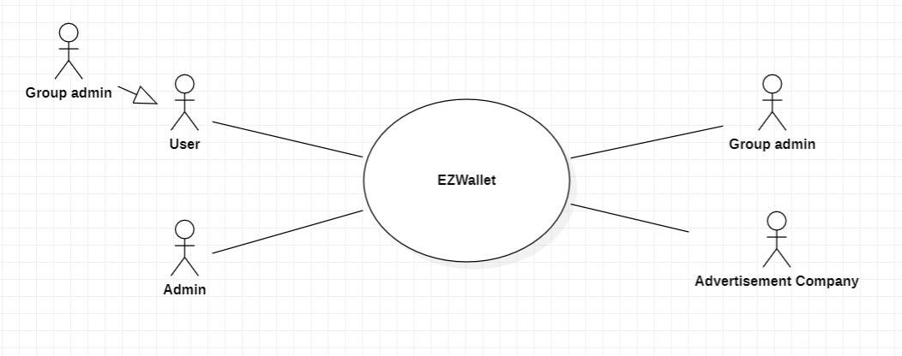
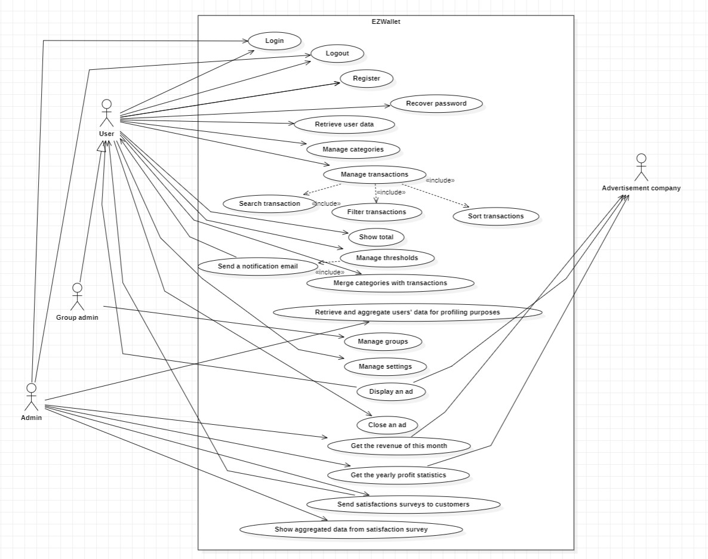
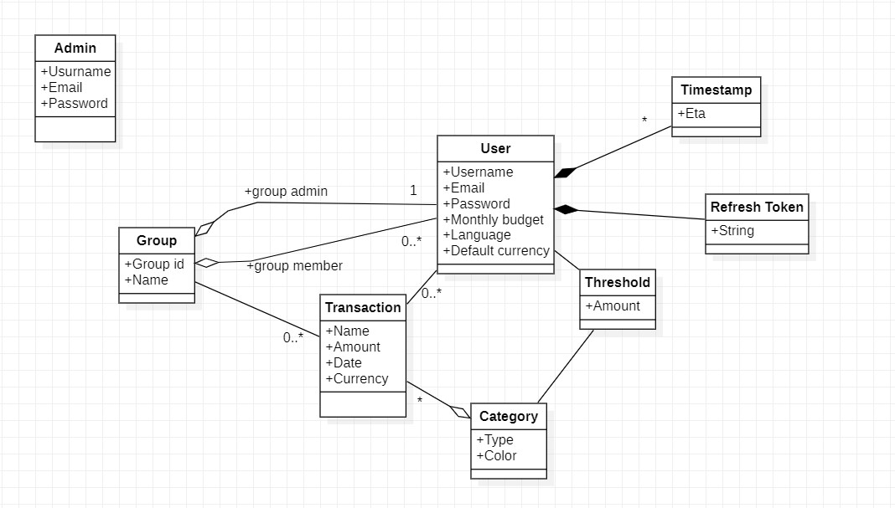
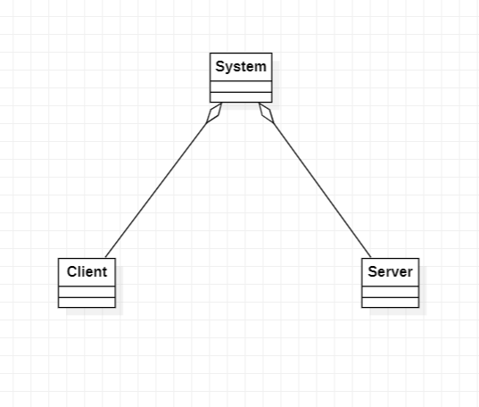
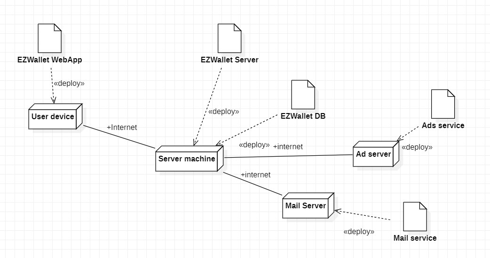

# Requirements Document - future EZWallet

Date: 27-04-2023

Version: V2 - description of EZWallet in FUTURE form (as proposed by the team)

| Version number | Change                                                                      |
|----------------|:----------------------------------------------------------------------------|
| 1.0            | Start: retrieved the starting point from RequirementsDocumentV1             |
| 2.0            | Defined the following: business model, stakeholders, interfaces             |
| 2.1            | Defined the following: stories and personas, use cases                      |
| 3.0            | Added some functional requirements and use cases scenarios, table of rights |
| 4.0            | Modified, from the V1: glossary, system design, system deployment           |
| 5.0            | General revision of the document, some fixes and minor additions            |

# Contents

- [Informal description](#informal-description)
- <a href="#business-model">Business Model</a>
- [Stakeholders](#stakeholders)
- [Context Diagram and interfaces](#context-diagram-and-interfaces)
	+ [Context Diagram](#context-diagram)
	+ [Interfaces](#interfaces)

- [Stories and personas](#stories-and-personas)
- [Functional and non functional requirements](#functional-and-non-functional-requirements)
	+ [Functional Requirements](#functional-requirements)
	+ [Non functional requirements](#non-functional-requirements)
- [Use case diagram and use cases](#use-case-diagram-and-use-cases)
	+ [Use case diagram](#use-case-diagram)
	+ [Use cases](#use-cases)
		+ [Relevant scenarios](#relevant-scenarios)
- [Glossary](#glossary)
- [System design](#system-design)
- [Deployment diagram](#deployment-diagram)

# Informal description
EZWallet (read EaSy Wallet) is a software application designed to help individuals and families keep track of their expenses. Users can enter and categorize their expenses, allowing them to quickly see where their money is going. EZWallet is a powerful tool for those looking to take control of their finances and make informed decisions about their spending.

# Business model
The application is offered for free, so users can access freely by making an account, but advertisements will be shown in the main page.

# Stakeholders

| Stakeholder name      |                        Description                        | 
|-----------------------|:---------------------------------------------------------:|
| User                  |             person that uses the application              |
| Application store     |   stakeholder in charge of distributing our application   |
| Admin                 |            person that manages the application            |
| Advertisement company |   organization that pays to add ads to the application    |
| Mail company          | company that offers a mailbox to send emails to the users |

# Context Diagram and interfaces
## Context Diagram

</img>

## Interfaces

| Actor                 | Logical Interface |          Physical Interface |
|-----------------------|:-----------------:|----------------------------:|
| User                  |        GUI        | Keyboard, monitor and mouse |
| Admin                 |        GUI        | Keyboard, monitor and mouse |
| Group admin           |        GUI        | Keyboard, monitor and mouse |
| Advertisement company |        API        |                    Internet |
| Mail company          |        API        |                    Internet |

# Stories and personas

##### Woman, 40 years old:

She wants to keep track of her expenses, and she uses EZWallet. She adds a category "Bills" and add all her monthly bills to it
as transactions in order to group them together and see how much she spends on bills each month. She then does the same with
her groceries, and her entertainment expenses. She can now see how much she spends on each category and can make informed
decisions about her spending.

##### Out-of-doors university student, 22 years old:

He has a limited budget due to his student status, and he wants to monitor his expenses. He uses EZWallet and adds some categories:
"Food", "Bills", "Rent" and "Other". He adds every transaction he makes to the corresponding category. He can now see how much he
spends on each category, so he can try to stay within his monthly budget.

##### Young couple, 25 years old:

They have lived together for a few months and believe in being financially responsible. EZWallet is their trusted app
to accomplish their vision: they use a shared account to manage their common money. They separate their expenses into categories
to distinguish them better: in this way, they are able to aggregate transactions under categories. Using EZWallet, they can save
money each month and can accumulate it to buy a house.

##### Man, 27 Years old:

He lives alone and, as a very busy person, he has little time to keep track of his expenses. EZWallet lets him easily add a transaction in just a few seconds.
The transaction will appear in the list of transactions and, eventually, he will be able to easily delete it in no time.
EZWallet is therefore easy to use and doesn't take too much of his time.

##### Grandfather, 80 years old:
He is retired and has a lot of free time. He wants to keep track of his expenses, so he uses EZWallet. He adds a category "Bills" and add all his monthly bills to it
as transactions in order to group them together and see how much he spends on bills each month. He also has a group with his wife to track the family.

##### Student, 25 years old:
He studies at the university and needs to reduce his expenses. He installs EZWallet and adds some categories and transactions to it. He also has a group with his
other flatmates to track the expenses of the house, he is the group admin and added them by sharing a link.

##### Admin, 30 years old:
He is the COO. He manages the users of the application. He can also see all the statistics on how the application is growing over time.

# Functional and non functional requirements

## Functional Requirements

| ID     |                              Description                              |
|--------|:---------------------------------------------------------------------:| 
| FR1    |                        Authentication (OAuth)                         |
| FR1.1  |                                 Login                                 |
| FR1.2  |                                Logout                                 |
| FR1.3  |                               Register                                |
| FR1.4  |                         Refresh Access Token                          |
| FR1.5  |                            Reset password                             |
| FR2    |                                 User                                  |
| FR2.1  |                           Get all the users                           | 
| FR2.2  |                      Get all the data of a user                       |
| FR2.3  |                             Delete a user                             |
| FR2.4  |                             Search a user                             |
| FR3    |                              Categories                               |
| FR3.1  |                           Create a category                           |
| FR3.2  |                        Get all the categories                         |
| FR4    |                             Transactions                              |
| FR4.1  |                         Create a transaction                          |
| FR4.2  |                       Get all the transactions                        |
| FR4.3  |                         Delete a transaction                          |
| FR4.4  |                         Sort all transactions                         |
| FR4.5  |                          Search transaction                           |
| FR4.6  |                          Filter transactions                          |
| FR5    |                             Data analysis                             |
| FR5.1  |                  Merge categories with transactions                   |
| FR5.2  |                              Show total                               |
| FR5.3  |             Aggregate users' data for profiling purposes              |
| FR6    |                                Groups                                 |
| FR6.1  |                             Create group                              |
| FR6.2  |                             Delete group                              |
| FR6.3  |                         Add user to the group                         |
| FR6.4  |                       Remove user to the group                        |
| FR6.5  |                            Leave the group                            |
| FR7    |                               Settings                                |
| FR7.1  |                       Set/Change monthly budget                       |
| FR7.2  |                          Set/Change Currency                          |
| FR7.3  |                          Set/Change Language                          |
| FR8    |                                 Mail                                  |
| FR8.1  |                           Login to the mail                           |
| FR8.2  |                              Send a mail                              |
| FR9    |                            Advertisements                             |
| FR9.1  |                  Login to the advertisement company                   |
| FR9.2  |                             Display an ad                             |
| FR9.3  |                             Close the ad                              |
| FR9.4  |                     Get the revenue of this month                     |
| FR9.5  |                   Get the yearly profit statistics                    |
| FR10   |                         Customer satisfaction                         |
| FR10.1 |         Send a satisfaction survey to a random subset (email)         |
| FR10.2 |          Analyze and retrieve data from satisfaction survey           |
| FR10.3 |                     Create a satisfaction survey                      |
| FR10.4 |               Add a question to the satisfaction survey               |
| FR10.5 |            Remove a question from the satisfaction survey             |
| FR11   |                              Thresholds                               |
| FR11.1 |                Add a threshold for a specific category                |
| FR11.2 |              Remove a threshold for a specific category               |
| FR11.3 |              Modify a threshold for a specific category               |
| FR11.4 | Send an email notification when the user exceeds 90% of the threshold | <!-- technically this shouldn't be a use case because the user doesn't set it --> |
| FR12   |                                 Links                                 |
| FR12.1 |                        Create a one time link                         |
| FR12.2 |                             Delete a link                             |

## Table of access rights

|        | User | Group Admin | Admin | Advertisement company | Mail company | 
|--------|:----:|:-----------:|:-----:|:---------------------:|:------------:|
| FR1.1  |  x   |      x      |   x   |                       |              | 
| FR1.2  |  x   |      x      |   x   |                       |              |
| FR1.3  |  x   |      x      |       |                       |              |
| FR1.4  |  x   |      x      |   x   |                       |              |
| FR1.5  |  x   |      x      |   x   |                       |              |
| FR2.1  |      |             |   x   |                       |              |
| FR2.2  |  x   |      x      |   x   |                       |              |	
| FR2.3  |      |             |   x   |                       |              |  	
| FR2.4  |      |             |   x   |                       |              |
| FR3.1  |  x   |      x      |       |                       |              |
| FR3.2  |  x   |      x      |       |                       |              |
| FR4.1  |  x   |      x      |       |                       |              |
| FR4.2  |  x   |      x      |       |                       |              |
| FR4.4  |  x   |      x      |       |                       |              |
| FR4.5  |  x   |      x      |       |                       |              |
| FR4.6  |  x   |      x      |       |                       |              |
| FR5.1  |  x   |      x      |       |                       |              |
| FR5.2  |  x   |      x      |       |                       |              |
| FR5.3  |      |             |   x   |                       |              |
| FR6.1  |  x   |      x      |       |                       |              |             
| FR6.2  |      |      x      |       |                       |              |            
| FR6.3  |      |      x      |       |                       |              |
| FR6.4  |      |      x      |       |                       |              |
| FR6.5  |  x   |      x      |       |                       |              |
| FR7    |  x   |      x      |       |                       |              |             
| FR7.1  |  x   |      x      |       |                       |              |            
| FR7.2  |  x   |      x      |       |                       |              |           
| FR7.3  |  x   |      x      |       |                       |              |          
| FR8.1  |      |             |       |                       |              |         
| FR8.2  |      |             |       |                       |              |        
| FR9.1  |      |             |       |                       |              |       
| FR9.2  |      |             |       |                       |              |      
| FR9.3  |  x   |      x      |       |                       |              |     
| FR9.4  |      |             |       |                       |              |    
| FR9.5  |      |             |       |                       |              |   
| FR10.1 |      |             |   x   |                       |              |  
| FR10.2 |      |             |   x   |                       |              | 
| FR10.3 |      |             |   x   |                       |              |
| FR10.4 |      |             |   x   |                       |              |
| FR10.5 |      |             |   x   |                       |              |
| FR11.1 |  x   |      x      |       |                       |              |
| FR11.2 |  x   |      x      |       |                       |              |
| FR11.3 |  x   |      x      |       |                       |              |
| FR11.4 |      |             |       |                       |              |
| FR12.1 |      |             |       |                       |              |
| FR12.2 |      |             |       |                       |              |

## Non Functional Requirements

| ID   | Type (efficiency, reliability, ..) |                                                     Description                                                     |                                               Refers to |
|------|:----------------------------------:|:-------------------------------------------------------------------------------------------------------------------:|--------------------------------------------------------:|
| NFR1 |             Usability              | main functions for user designed easy recognizable, the user should need less than 5 minutes to learn how to use it |                                 All the functionalities |
| NFR2 |              Security              |               any unauthorized access restricted immediately, should follow the store security rules                |                                 All the functionalities |
| NFR3 |            Correctness             |                                     Results of the analysis have to be correct                                      | User,Data Analysis,Advertisements,Customer Satisfaction |
| NFR4 |             Efficiency             |                            Results of the analysis have to be displayed within 5 seconds                            | User,Data Analysis,Advertisements,Customer Satisfaction |
| NFR5 |            Availability            |  the application have a maximum amount of 15 minutes of downtime during the day hours and 5 hours during the night  |                                 All the functionalities |

# Use case diagram and use cases

## Use case diagram

<!-- let's find a way to include the diagram image (it's way too large) -->
</img>

## Use cases

### Login
### Logout
### Register
### Recover password
### Retrieve user data
### Manage categories
### Manage transactions
#### Search transaction
#### Filter transactions
#### Sort transactions
### Show total
### Manage thresholds
#### Send a notification email
### Merge categories with transactions
### Retrieve and aggregate users' data for profiling purposes
### Manage groups
### Manage settings
### Display an ad
### Close an ad
### Get the revenue of this month
### Get the yearly profit statistics
### Create and send satisfactions survey to customers
### Show aggregated data from satisfaction survey
### Delete User
### Search User

# Relevant scenarios

### Use case 1, Login
##### Scenario 1.1
| Scenario 1.1   |                                     |
|----------------|:-----------------------------------:|
| Precondition   |        user is not logged in        |
| Post condition |          user is logged in          |
| Step#          |             Description             |
| 1              | user enters his email and password  |
| 2              |     user clicks on login button     |
| 3              | user is redirected to his home page |

### Use case 2, Logout
##### Scenario 2.1
| Scenario 2.1   |                                         |
|----------------|:---------------------------------------:|
| Precondition   |            user is logged in            |
| Post condition |          user is not logged in          |
| Step#          |               Description               |
| 1              |      user clicks on logout button       |
| 2              | user is redirected to general main page |

### Use case 3, Register
##### Scenario 3.1
| Scenario 3.1   |                                              |
|----------------|:--------------------------------------------:|
| Precondition   |            user is not registered            |
| Post condition |              user is registered              |
| Step#          |                 Description                  |
| 1              | user enters his email, username and password |
| 2              |        user clicks on register button        |
| 3              |       user is redirected to login page       |

### Use case 4, Recover password
##### Scenario 4.1
| Scenario 4.1   |                                        |
|----------------|:--------------------------------------:|
| Precondition   |           user is registered           |
| Post condition |           password is reset            |
| Step#          |              Description               |
| 1              | user clicks on "reset password" button |
| 2              |         user enters his email          |
| 3              |   user clicks on "Send email" button   |
| 4              |  user clicks on the link in the email  |
| 5              | user enters his new password and saves |
| 6              |    user is redirected to login page    |

<!-- NO REFRESH TOKEN, IT'S A FUNCTIONAL REQUIREMENT BECAUSE IT NEEDS TO BE DEVELOPED BUT IS NOT A USE CASE (USER IS NOT AWARE OF IT!)-->

### Use case 5, Retrieve user data
#### Scenario 5.1
| Scenario 5.1   |                                       |
|----------------|:-------------------------------------:|
| Precondition   |          admin is logged in           |
| Post condition | information about all users retrieved |
| Step#          |              Description              |
| 1              | admin looks for all users information |
| 2              | admin clicks on the "confirm" button  |

### Use case 6, Manage categories
#### Scenario 6.1
| Scenario 6.1   |                                                |
|----------------|:----------------------------------------------:|
| Precondition   |         category is not created/added          |
| Post condition |           category is created/added            |
| Step#          |                  Description                   |
| 1              |       user clicks "new category" button.       |
| 2              | user enters type and color of current category |
| 3              |            user clicks enter button            |

#### Scenario 6.2
| Scenario 6.2   |                                    |
|----------------|:----------------------------------:|
| Precondition   |   category is not created/added    |
| Post condition |     category is created/added      |
| Step#          |            Description             |
| 1              | user clicks "new category" button. |
| 2              |    user clicks on enter button     |

#### Scenario 6.3
| Scenario 6.3   |                                                   |
|----------------|:-------------------------------------------------:|
| Precondition   |            category list is not shown             |
| Post condition |              category list is shown               |
| Step#          |                    Description                    |
| 1              | user press on the select category dropdown button |
| 2              |          system retrieves all categories          |

### Use case 7, Manage transactions
#### Scenario 7.1
| Scenario 7.1   |                                                                                    |
|----------------|:----------------------------------------------------------------------------------:|
| Precondition   |                              transaction is not added                              |
| Post condition |                                transaction is added                                |
| Step#          |                                    Description                                     |
| 1              |                         user selects "add new transaction"                         |
| 2              |       user enters respectively name, type and amount of the new transaction        |
| 3              |                          user clicks on "confirm" button                           |

#### Scenario 7.2
| Scenario 7.2   |                                   |
|----------------|:---------------------------------:|
| Precondition   |   transaction list is not shown   |
| Post condition |     transaction list is shown     |
| Step#          |            Description            |
| 1              |    user opens the application     |
| 2              | system retrieves all transactions |

#### Scenario 7.3
| Scenario 7.3   |                                              |
|----------------|:--------------------------------------------:|
| Precondition   |          transaction is in the list          |
| Post condition |           transaction was deleted            |
| Step#          |                 Description                  |
| 1              | user hovers on the transaction to be deleted |
| 2              |        user clicks on "delete" button        |
| 3              |  user confirms deletion of the transaction   |

### Use case 7.1, Search transaction
#### Scenario 7.1.1
| Scenario 7.1.1 |                                          |
|----------------|:----------------------------------------:|
| Precondition   | the desired transaction is not displayed |
| Post condition |     the desired transaction is shown     |
| Step#          |               Description                |
| 1              | user enters the name of the transaction  |
| 2              |     user clicks on the search button     |

### Use case 7.2, Filter transactions
#### Scenario 7.2.1
| Scenario 7.2.1 |                                                          |
|----------------|:--------------------------------------------------------:|
| Precondition   |                transaction list displayed                |
| Post condition | transaction list filtered according to research criteria |
| Step#          |                       Description                        |
| 1              |         user clicks on the filter and sort icon          |
| 2              | user selects the desired filter criteria and apply them  |

### Use case 7.3, Sort transactions
#### Scenario 7.3.1
| Scenario 7.3.1 |                                                     |
|----------------|:---------------------------------------------------:|
| Precondition   |             transaction list displayed              |
| Post condition | transaction list sorted according to sort criteria  |
| Step#          |                     Description                     |
| 1              |       user clicks on the filter and sort icon       |
| 2              | user selects the desired sort criteria and apply it |

### Use case 8, Show total
#### Scenario 8.1
| Scenario 8.1   |                                                 |
|----------------|:-----------------------------------------------:|
| Precondition   |           transaction list displayed            |
| Post condition |      total amount of transactions is shown      |
| Step#          |                   Description                   |
| 1              |              user makes the login               |
| 2              | system displays the total in upper-right corner |

### Use case 9, Manage thresholds
#### Scenario 9.1
| Scenario 9.1   |                                                        |
|----------------|:------------------------------------------------------:|
| Precondition   |     threshold is not set for the desired category      |
| Post condition |       threshold is set for the desired category        |
| Step#          |                      Description                       |
| 1              |            user press on the personal icon             |
| 2              | user selects the desired category to set its threshold |
| 3              |   user enters the desired threshold for the category   |

#### Scenario 9.2
| Scenario 9.2   |                                                              |
|----------------|:------------------------------------------------------------:|
| Precondition   |          threshold is set for the desired category           |
| Post condition |        threshold is removed for the desired category         |
| Step#          |                         Description                          |
| 1              |               user press on the personal icon                |
| 2              | user change the threshold to a empty value near the category |

#### Scenario 9.3
| Scenario 9.3   |                                                    |
|----------------|:--------------------------------------------------:|
| Precondition   |     threshold is set for the desired category      |
| Post condition |   threshold is updated for the desired category    |
| Step#          |                    Description                     |
| 1              |          user press on the personal icon           |
| 2              | user selects the category and change the threshold |
### Use case 9.1, Send a notification email
#### Scenario 9.1.1
| Scenario 9.1.1 |                                                 |
|----------------|:-----------------------------------------------:|
| Precondition   |      user exceeds the 90% of the threshold      |
| Post condition | user is notified that he exceeded the threshold |
| Step#          |                   Description                   |
| 1              |    a mail is sent to the user to notify him     |

### Use case 10, Merge categories with transactions
#### Scenario 10.1
| Scenario 10.1  |                                                                               |
|----------------|:-----------------------------------------------------------------------------:|
| Precondition   |                               user is logged in                               |
| Post condition |        transactions enriched with their belonging category information        |
| Step#          |                                  Description                                  |
| 1              |                     user displays the transaction section                     |
| 2              | system retrieves all transactions and categories and match them automatically |

### Use case 11, Retrieve and aggregate users' data for profiling purposes
#### Scenario 11.1
| Scenario 11.1  |                          |
|----------------|:------------------------:|
| Precondition   |     admin is logged      |
| Post condition |  users' data retrieved   |
| Step#          |       Description        |
| 1              | admin press on user list |

#### Scenario 11.2
| Scenario 11.2  |                                                      |
|----------------|:----------------------------------------------------:|
| Precondition   |           admin has retrieved users' data            |
| Post condition | users' data is aggregated according to some criteria |
| Step#          |                     Description                      |
| 1              |         admin press on the statistics button         |
| 2              |            admin selects user statistics             |

### Use case 12, Manage groups
#### Scenario 12.1
| Scenario 12.1  |                                                                  |
|----------------|:----------------------------------------------------------------:|
| Precondition   |                      group is not available                      |
| Post condition |                         group is created                         |
| Step#          |                           Description                            |
| 1              |                 user clicks on the group section                 |
| 2              |                     user clicks "add group"                      |
| 3              | user enters the group name and confirm, becoming the group admin |

#### Scenario 12.2
| Scenario 12.2  |                                                                     |
|----------------|:-------------------------------------------------------------------:|
| Precondition   |                         group is available                          |
| Post condition |                          group is deleted                           |
| Step#          |                             Description                             |
| 1              |               group admin clicks on the group section               |
| 2              | group admin clicks on the delete button near the group to delete it |

#### Scenario 12.3
| Scenario 12.3  |                                                                |
|----------------|:--------------------------------------------------------------:|
| Precondition   |                       group is available                       |
| Post condition |                      user joins the group                      |
| Step#          |                          Description                           |
| 1              |            group admin clicks on the group section             |
| 2              |  group admin clicks on the group where he needs to add a user  |
| 3              | group admin send the join link to the user by email or copy it |

#### Scenario 12.4
| Scenario 12.4  |                                                                 |
|----------------|:---------------------------------------------------------------:|
| Precondition   |                       group is available                        |
| Post condition |                 user is removed from the group                  |
| Step#          |                           Description                           |
| 1              |             group admin clicks on the group section             |
| 2              | group admin clicks on the group where he needs to remove a user |
| 3              |  group admin press the delete button near the user and confirm  |

#### Scenario 12.5
| Scenario 12.5  |                                             |
|----------------|:-------------------------------------------:|
| Precondition   |           user belongs to a group           |
| Post condition |            user leave the group             |
| Step#          |                 Description                 |
| 1              |      user clicks on the group section       |
| 2              | user clicks on the leave button and confirm |

### Use case 13, Manage settings
#### Scenario 13.1
| Scenario 13.1  |                                  |
|----------------|:--------------------------------:|
| Precondition   |        user is logged in         |
| Post condition |        monthly budget set        |
| Step#          |           Description            |
| 1              | user clicks on the personal icon |
| 2              |  user enters the monthly budget  |

#### Scenario 13.2
| Scenario 13.2  |                                   |
|----------------|:---------------------------------:|
| Precondition   |         user is logged in         |
| Post condition |           currency set            |
| Step#          |            Description            |
| 1              | user clicks on the personal icon  |
| 2              | user selects the default currency |

#### Scenario 13.3
| Scenario 13.3  |                                  |
|----------------|:--------------------------------:|
| Precondition   |        user is logged in         |
| Post condition |           language set           |
| Step#          |           Description            |
| 1              | user clicks on the personal icon |
| 2              |    user selects the language     |

### Use case 14, Display an ad
#### Scenario 14.1
| Scenario 14.1  |                                                |
|----------------|:----------------------------------------------:|
| Precondition   |               user is logged in                |
| Post condition |                ad is displayed                 |
| Step#          |                  Description                   |
| 1              | system retrieves an ad using advertisement API |
| 2              |             ad is sent to the user             |

### Use case 15, Close an ad
#### Scenario 15.1
| Scenario 15.1  |                             |
|----------------|:---------------------------:|
| Precondition   |       ad is displayed       |
| Post condition |          ad closed          |
| Step#          |         Description         |
| 1              | user clicks on the x button |

### Use case 16, Get the revenue of this month
#### Scenario 16.1
| Scenario 16.1  |                                                      |
|----------------|:----------------------------------------------------:|
| Precondition   |                  admin is logged in                  |
| Post condition |            current month revenue is shown            |
| Step#          |                     Description                      |
| 1              |        admin clicks on the statistics section        |
| 2              | admin clicks on the advertisements statistics button |

### Use case 17, Get the yearly profit statistics
#### Scenario 17.1
| Scenario 17.1  |                                                      |
|----------------|:----------------------------------------------------:|
| Precondition   |                  admin is logged in                  |
| Post condition |            yearly profit statistics shown            |
| Step#          |                     Description                      |
| 1              |        admin clicks on the statistics section        |
| 2              | admin clicks on the advertisements statistics button |

### Use case 18, Create and send satisfaction surveys to customers
#### Scenario 18.1
| Scenario 18.1  |                                                    |
|----------------|:--------------------------------------------------:|
| Precondition   |                 admin is logged in                 |
| Post condition |              satisfaction survey sent              |
| Step#          |                    Description                     |
| 1              |         admin clicks on the survey section         |
| 2              | admin sets the survey questions and answer options |
| 3              |          admin clicks on the send button           |

### Use case 19, Show aggregated data from satisfaction survey
#### Scenario 19.1
| Scenario 19.1  |                                                     |
|----------------|:---------------------------------------------------:|
| Precondition   |                 admin is logged in                  |
| Post condition |        satisfaction survey statistics shown         |
| Step#          |                     Description                     |
| 1              |         admin clicks on the survey section          |
| 2              | admin selects the criteria to aggregate the data by |

### Use case 20, Delete User
#### Scenario 20.1
| Scenario 20.1  |                                                      |
|----------------|:----------------------------------------------------:|
| Precondition   |                  admin is logged in                  |
| Post condition |                   user is deleted                    |
| Step#          |                     Description                      |
| 1              |        admin clicks on the user list section         |
| 2              | admin press the delete button near the selected user |

### Use case 21, Search User
#### Scenario 21.1
| Scenario 21.1  |                                       |
|----------------|:-------------------------------------:|
| Precondition   |          admin is logged in           |
| Post condition |             user is found             |
| Step#          |              Description              |
| 1              | admin clicks on the list user section |
| 2              | admin enters the user name to search  |

# Glossary

</img>

# System Design

</img>

# Deployment Diagram

</img>

