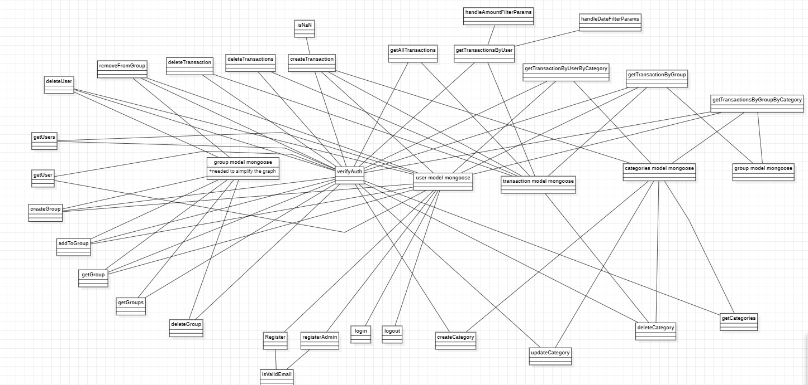

# Test Report

<The goal of this document is to explain how the application was tested, detailing how the test cases were defined and what they cover>

# Contents

- [Dependency graph](#dependency-graph)

- [Integration approach](#integration-approach)

- [Tests](#tests)

- [Coverage](#Coverage)

# Dependency graph 

     <report the here the dependency graph of EzWallet>
</img>

     
# Integration approach

    <Write here the integration sequence you adopted, in general terms (top down, bottom up, mixed) and as sequence
    (ex: step1: unit A, step 2: unit A+B, step 3: unit A+B+C, etc)> 
    <Some steps may  correspond to unit testing (ex step1 in ex above)>
    <One step will  correspond to API testing, or testing unit route.js>
Bottom up approach was used for integration testing. The following steps were followed:
we tested before all the mongoose models and the verifyAuth which are the base of the application.
Then we tested auth.js for having a simple way to insert the tokens used by the verifyAuth in the database
Then we tested user.js and controller.js

# Tests

   <in the table below list the test cases defined For each test report the object tested, the test level (API, integration, unit) and the technique used to define the test case  (BB/ eq partitioning, BB/ boundary, WB/ statement coverage, etc)>   <split the table if needed>

| Test case name                                                                                                                      | Object(s) tested                 | Test level  | Technique used        |
|-------------------------------------------------------------------------------------------------------------------------------------|----------------------------------|-------------|-----------------------|
| UTILS.JS                                                                                                                            |                                  |             |                       |
| Should return true for valid simple authentication (authType=Simple)                                                                | VerifyAuth                       | Unit        | WB/statement coverage |
| Should return false for missing parameter                                                                                           | VerifyAuth                       | Unit        | WB/statement coverage |
| Mismatched users                                                                                                                    | VerifyAuth                       | Unit        | WB/statement coverage |
| User authorized                                                                                                                     | VerifyAuth                       | Unit        | WB/statement coverage |
| User mismatched username                                                                                                            | VerifyAuth                       | Unit        | WB/statement coverage |
| Admin authorized                                                                                                                    | VerifyAuth                       | Unit        | WB/statement coverage |
| Admin not authorized                                                                                                                | VerifyAuth                       | Unit        | WB/statement coverage |
| Group authorized                                                                                                                    | Auth                             | Unit        | WB/statement coverage |
| Group not authorized                                                                                                                | Auth                             | Unit        | WB/statement coverage |
| Should return true for valid simple authentication (authType=Simple)                                                                | Auth                             | Unit        | WB/statement coverage |
| Should return false, everything is Expired                                                                                          | Auth                             | Unit        | WB/statement coverage |
| returns empty filter if no amount filter is specified                                                                               | handleAmountFilterParams         | Unit        | WB/statement coverage |
| returns filter with $gte and $lte properties if both min and max are valid numbers                                                  | handleAmountFilterParams         | Unit        | WB/statement coverage |
| returns filter with only $gte property if min is a valid number and max is not specified                                            | handleAmountFilterParams         | Unit        | WB/statement coverage |
| returns filter with only $lte property if max is a valid number and min is not specified                                            | handleAmountFilterParams         | Unit        | WB/statement coverage |
| throws an error if min and max parameters are invalid                                                                               | handleAmountFilterParams         | Unit        | WB/statement coverage |
| returns true if both min and max are valid numbers                                                                                  | checkMinMaxParams                | Unit        | WB/statement coverage |
| returns true if min is undefined and max is a valid number                                                                          | checkMinMaxParams                | Unit        | WB/statement coverage |
| returns true if min is a valid number and max is undefined                                                                          | checkMinMaxParams                | Unit        | WB/statement coverage |
| returns false if min is not a number                                                                                                | checkMinMaxParams                | Unit        | WB/statement coverage |
| returns false if max is not a number                                                                                                | checkMinMaxParams                | Unit        | WB/statement coverage |
| returns false if min is negative                                                                                                    | checkMinMaxParams                | Unit        | WB/statement coverage |
| returns false if max is negative                                                                                                    | checkMinMaxParams                | Unit        | WB/statement coverage |
| returns false if min is greater than max                                                                                            | checkMinMaxParams                | Unit        | WB/statement coverage |
| returns true for a valid date                                                                                                       | checkDate                        | Unit        | WB/statement coverage |
| returns false for an invalid date                                                                                                   | checkDate                        | Unit        | WB/statement coverage |
| returns false for an invalid date format                                                                                            | checkDate                        | Unit        | WB/statement coverage |
| returns false for an empty date                                                                                                     | checkDateFormat                  | Unit        | WB/statement coverage |
| returns false for a non-string date                                                                                                 | checkDateFormat                  | Unit        | WB/statement coverage |
| returns true if all parameters are valid                                                                                            | checkDateParams                  | Unit        | WB/statement coverage |
| returns true if only one parameter is valid                                                                                         | checkDateParams                  | Unit        | WB/statement coverage |
| returns false if date parameter is invalid                                                                                          | checkDateParams                  | Unit        | WB/statement coverage |
| returns false if from parameter is invalid                                                                                          | checkDateParams                  | Unit        | WB/statement coverage |
| returns false if upTo parameter is invalid                                                                                          | checkDateParams                  | Unit        | WB/statement coverage |
| returns false if date is present along with from or upTo                                                                            | checkDateParams                  | Unit        | WB/statement coverage |
| returns false if from is greater than upTo                                                                                          | checkDateParams                  | Unit        | WB/statement coverage |
| Should return the correct date filter                                                                                               | handleDateFilterParams           | Unit        | WB/statement coverage |
| Should return the correct date filter 1                                                                                             | handleDateFilterParams           | Unit        | WB/statement coverage |
| Should return the correct date filter 2                                                                                             | handleDateFilterParams           | Unit        | WB/statement coverage |
| Should return the correct date filter 3                                                                                             | handleDateFilterParams           | Unit        | WB/statement coverage |
| Should return error                                                                                                                 | handleDateFilterParams           | Unit        | WB/statement coverage |
| Should return error1                                                                                                                | handleDateFilterParams           | Unit        | WB/statement coverage |
| Should return error2                                                                                                                | handleDateFilterParams           | Unit        | WB/statement coverage |
| Should return true for valid simple authentication (authType=Simple)                                                                | VerifyAuth                       | Integration | WB/statement coverage |
| Should return false for missing parameter                                                                                           | VerifyAuth                       | Integration | WB/statement coverage |
| Mismatched users                                                                                                                    | VerifyAuth                       | Integration | WB/statement coverage |
| User authorized                                                                                                                     | VerifyAuth                       | Integration | WB/statement coverage |
| User mismatched username                                                                                                            | VerifyAuth                       | Integration | WB/statement coverage |
| Admin authorized                                                                                                                    | VerifyAuth                       | Integration | WB/statement coverage |
| Admin not authorized                                                                                                                | VerifyAuth                       | Integration | WB/statement coverage |
| Group authorized                                                                                                                    | Auth                             | Integration | WB/statement coverage |
| Group not authorized                                                                                                                | Auth                             | Integration | WB/statement coverage |
| Should return true for valid simple authentication (authType=Simple)                                                                | Auth                             | Integration | WB/statement coverage |
| Should return false, everything is Expired                                                                                          | Auth                             | Integration | WB/statement coverage |
| returns empty filter if no amount filter is specified                                                                               | handleAmountFilterParams         | Integration | WB/statement coverage |
| returns filter with $gte and $lte properties if both min and max are valid numbers                                                  | handleAmountFilterParams         | Integration | WB/statement coverage |
| returns filter with only $gte property if min is a valid number and max is not specified                                            | handleAmountFilterParams         | Integration | WB/statement coverage |
| returns filter with only $lte property if max is a valid number and min is not specified                                            | handleAmountFilterParams         | Integration | WB/statement coverage |
| throws an error if min and max parameters are invalid                                                                               | handleAmountFilterParams         | Integration | WB/statement coverage |
| returns true if both min and max are valid numbers                                                                                  | checkMinMaxParams                | Integration | WB/statement coverage |
| returns true if min is undefined and max is a valid number                                                                          | checkMinMaxParams                | Integration | WB/statement coverage |
| returns true if min is a valid number and max is undefined                                                                          | checkMinMaxParams                | Integration | WB/statement coverage |
| returns false if min is not a number                                                                                                | checkMinMaxParams                | Integration | WB/statement coverage |
| returns false if max is not a number                                                                                                | checkMinMaxParams                | Integration | WB/statement coverage |
| returns false if min is negative                                                                                                    | checkMinMaxParams                | Integration | WB/statement coverage |
| returns false if max is negative                                                                                                    | checkMinMaxParams                | Integration | WB/statement coverage |
| returns false if min is greater than max                                                                                            | checkMinMaxParams                | Integration | WB/statement coverage |
| returns true for a valid date                                                                                                       | checkDate                        | Integration | WB/statement coverage |
| returns false for an invalid date                                                                                                   | checkDate                        | Integration | WB/statement coverage |
| returns false for an invalid date format                                                                                            | checkDate                        | Integration | WB/statement coverage |
| returns false for an empty date                                                                                                     | checkDateFormat                  | Integration | WB/statement coverage |
| returns false for a non-string date                                                                                                 | checkDateFormat                  | Integration | WB/statement coverage |
| returns true if all parameters are valid                                                                                            | checkDateParams                  | Integration | WB/statement coverage |
| returns true if only one parameter is valid                                                                                         | checkDateParams                  | Integration | WB/statement coverage |
| returns false if date parameter is invalid                                                                                          | checkDateParams                  | Integration | WB/statement coverage |
| returns false if from parameter is invalid                                                                                          | checkDateParams                  | Integration | WB/statement coverage |
| returns false if upTo parameter is invalid                                                                                          | checkDateParams                  | Integration | WB/statement coverage |
| returns false if date is present along with from or upTo                                                                            | checkDateParams                  | Integration | WB/statement coverage |
| returns false if from is greater than upTo                                                                                          | checkDateParams                  | Integration | WB/statement coverage |
| Should return the correct date filter                                                                                               | handleDateFilterParams           | Integration | WB/statement coverage |
| Should return the correct date filter 1                                                                                             | handleDateFilterParams           | Integration | WB/statement coverage |
| Should return the correct date filter 2                                                                                             | handleDateFilterParams           | Integration | WB/statement coverage |
| Should return the correct date filter 3                                                                                             | handleDateFilterParams           | Integration | WB/statement coverage |
| Should return error                                                                                                                 | handleDateFilterParams           | Integration | WB/statement coverage |
| Should return error1                                                                                                                | handleDateFilterParams           | Integration | WB/statement coverage |
| Should return error2                                                                                                                | handleDateFilterParams           | Integration | WB/statement coverage |
| AUTH.JS                                                                                                                             |                                  |             |                       |
| register value:200                                                                                                                  | register                         | Unit        | WB/statement coverage |
| register value:400 invalid email                                                                                                    | register                         | Unit        | WB/statement coverage |
| register value:400 user exists                                                                                                      | register                         | Unit        | WB/statement coverage |
| register value:400 missing params                                                                                                   | register                         | Unit        | WB/statement coverage |
| register value:400 missing params                                                                                                   | register                         | Unit        | WB/statement coverage |
| register value:200                                                                                                                  | registerAdmin                    | Unit        | WB/statement coverage |
| register value:400 invalid email                                                                                                    | registerAdmin                    | Unit        | WB/statement coverage |
| register value:400 user exists                                                                                                      | registerAdmin                    | Unit        | WB/statement coverage |
| register value:400 missing params                                                                                                   | registerAdmin                    | Unit        | WB/statement coverage |
| register value:400 existing admin                                                                                                   | registerAdmin                    | Unit        | WB/statement coverage |
| register value:400 missing params                                                                                                   | registerAdmin                    | Unit        | WB/statement coverage |
| login done                                                                                                                          | login                            | Unit        | WB/statement coverage |
| login failed                                                                                                                        | login                            | Unit        | WB/statement coverage |
| login failed, password differs                                                                                                      | login                            | Unit        | WB/statement coverage |
| login failed missing parameters                                                                                                     | login                            | Unit        | WB/statement coverage |
| logout done                                                                                                                         | logout                           | Unit        | WB/statement coverage |
| logout failed                                                                                                                       | logout                           | Unit        | WB/statement coverage |
| logout failed 2                                                                                                                     | logout                           | Unit        | WB/statement coverage |
| register value:200                                                                                                                  | register                         | Integration | WB/statement coverage |
| register value:400 invalid email                                                                                                    | register                         | Integration | WB/statement coverage |
| register value:400 user exists                                                                                                      | register                         | Integration | WB/statement coverage |
| register value:400 missing params                                                                                                   | register                         | Integration | WB/statement coverage |
| register value:400 missing params                                                                                                   | register                         | Integration | WB/statement coverage |
| register value:200                                                                                                                  | registerAdmin                    | Integration | WB/statement coverage |
| register value:400 invalid email                                                                                                    | registerAdmin                    | Integration | WB/statement coverage |
| register value:400 user exists                                                                                                      | registerAdmin                    | Integration | WB/statement coverage |
| register value:400 missing params                                                                                                   | registerAdmin                    | Integration | WB/statement coverage |
| register value:400 existing admin                                                                                                   | registerAdmin                    | Integration | WB/statement coverage |
| register value:400 missing params                                                                                                   | registerAdmin                    | Integration | WB/statement coverage |
| login done                                                                                                                          | login                            | Integration | WB/statement coverage |
| login failed                                                                                                                        | login                            | Integration | WB/statement coverage |
| login failed, password differs                                                                                                      | login                            | Integration | WB/statement coverage |
| login failed missing parameters                                                                                                     | login                            | Integration | WB/statement coverage |
| logout done                                                                                                                         | logout                           | Integration | WB/statement coverage |
| logout failed                                                                                                                       | logout                           | Integration | WB/statement coverage |
| logout failed 2                                                                                                                     | logout                           | Integration | WB/statement coverage |
| USER.JS                                                                                                                             |                                  |             |                       |
| should return empty list if there are no users                                                                                      | getUsers                         | Unit        | WB/statement coverage |
| should retrieve list of all users                                                                                                   | getUsers                         | Unit        | WB/statement coverage |
| no such a user - should return an error                                                                                             | getUser                          | Unit        | WB/statement coverage |
| user calls getuser to retrieve own information                                                                                      | getUser                          | Unit        | WB/statement coverage |
| user calls getuser to retrieve another user's information - shouldn't be allowed                                                    | getUser                          | Unit        | WB/statement coverage |
| admin calls getuser to retrieve another user's information                                                                          | getUser                          | Unit        | WB/statement coverage |
| no name provided                                                                                                                    | createGroup                      | Unit        | WB/statement coverage |
| group is an empty string                                                                                                            | createGroup                      | Unit        | WB/statement coverage |
| not authorized user                                                                                                                 | createGroup                      | Unit        | WB/statement coverage |
| creator of the group not an existing user                                                                                           | createGroup                      | Unit        | WB/statement coverage |
| creator of the group already in a group                                                                                             | createGroup                      | Unit        | WB/statement coverage |
| another group with the same name already exists                                                                                     | createGroup                      | Unit        | WB/statement coverage |
| member email format not valid                                                                                                       | createGroup                      | Unit        | WB/statement coverage |
| all users are not in the system or in another group                                                                                 | createGroup                      | Unit        | WB/statement coverage |
| create a new group                                                                                                                  | createGroup                      | Unit        | WB/statement coverage |
| user not an admin                                                                                                                   | getGroups                        | Unit        | WB/statement coverage |
| user is an admin                                                                                                                    | getGroups                        | Unit        | WB/statement coverage |
| not authorized                                                                                                                      | getGroup                         | Unit        | WB/statement coverage |
| user doesn't exist                                                                                                                  | getGroup                         | Unit        | WB/statement coverage |
| group doesn't exist                                                                                                                 | getGroup                         | Unit        | WB/statement coverage |
| user in the group                                                                                                                   | getGroup                         | Unit        | WB/statement coverage |
| user not in the group, not an admin                                                                                                 | getGroup                         | Unit        | WB/statement coverage |
| user not in the group, an admin                                                                                                     | getGroup                         | Unit        | WB/statement coverage |
| memberEmails not provided                                                                                                           | addToGroup                       | Unit        | WB/statement coverage |
| user doesn't exist                                                                                                                  | addToGroup                       | Unit        | WB/statement coverage |
| group doesn't exist                                                                                                                 | addToGroup                       | Unit        | WB/statement coverage |
| not authorized                                                                                                                      | addToGroup                       | Unit        | WB/statement coverage |
| user not in group and not an admin                                                                                                  | addToGroup                       | Unit        | WB/statement coverage |
| user not in group and an admin (covers also user in group), but members not in the system or in another group                       | addToGroup                       | Unit        | WB/statement coverage |
| user not in group and an admin (covers also user in group), some members added                                                      | addToGroup                       | Unit        | WB/statement coverage |
| user doesn't exist                                                                                                                  | removeFromGroup                  | Unit        | WB/statement coverage |
| group doesn't exist                                                                                                                 | removeFromGroup                  | Unit        | WB/statement coverage |
| not authorized                                                                                                                      | removeFromGroup                  | Unit        | WB/statement coverage |
| user not in group and not an admin                                                                                                  | removeFromGroup                  | Unit        | WB/statement coverage |
| user not in group and an admin (covers also user in group), but members not in the system or in another group                       | removeFromGroup                  | Unit        | WB/statement coverage |
| user not in group and an admin (covers also user in group), only one member in the group, shouldn't remove                          | removeFromGroup                  | Unit        | WB/statement coverage |
| user not in group and an admin (covers also user in group), some members to remove (at least one required to keep the group)        | removeFromGroup                  | Unit        | WB/statement coverage |
| missing email                                                                                                                       | deleteUser                       | Unit        | WB/statement coverage |
| user is not an admin                                                                                                                | deleteUser                       | Unit        | WB/statement coverage |
| email to remove doesn't belong to any user                                                                                          | deleteUser                       | Unit        | WB/statement coverage |
| email to remove belongs to an admin                                                                                                 | deleteUser                       | Unit        | WB/statement coverage |
| email to remove belongs to a user in a group (the only member)                                                                      | deleteUser                       | Unit        | WB/statement coverage |
| missing group name                                                                                                                  | deleteGroup                      | Unit        | WB/statement coverage |
| group doesn't exist                                                                                                                 | deleteGroup                      | Unit        | WB/statement coverage |
| user not in group and not an admin                                                                                                  | deleteGroup                      | Unit        | WB/statement coverage |
| user not in group but admin (covers also user in the group), group removed                                                          | deleteGroup                      | Unit        | WB/statement coverage |
| should return empty list if there are no users                                                                                      | getUsers                         | Integration | WB/statement coverage |
| should retrieve list of all users                                                                                                   | getUsers                         | Integration | WB/statement coverage |
| no such a user - should return an error                                                                                             | getUser                          | Integration | WB/statement coverage |
| user calls getuser to retrieve own information                                                                                      | getUser                          | Integration | WB/statement coverage |
| user calls getuser to retrieve another user's information - shouldn't be allowed                                                    | getUser                          | Integration | WB/statement coverage |
| admin calls getuser to retrieve another user's information                                                                          | getUser                          | Integration | WB/statement coverage |
| no name provided                                                                                                                    | createGroup                      | Integration | WB/statement coverage |
| group is an empty string                                                                                                            | createGroup                      | Integration | WB/statement coverage |
| not authorized user                                                                                                                 | createGroup                      | Integration | WB/statement coverage |
| creator of the group not an existing user                                                                                           | createGroup                      | Integration | WB/statement coverage |
| creator of the group already in a group                                                                                             | createGroup                      | Integration | WB/statement coverage |
| another group with the same name already exists                                                                                     | createGroup                      | Integration | WB/statement coverage |
| member email format not valid                                                                                                       | createGroup                      | Integration | WB/statement coverage |
| all users are not in the system or in another group                                                                                 | createGroup                      | Integration | WB/statement coverage |
| create a new group                                                                                                                  | createGroup                      | Integration | WB/statement coverage |
| user not an admin                                                                                                                   | getGroups                        | Integration | WB/statement coverage |
| user is an admin                                                                                                                    | getGroups                        | Integration | WB/statement coverage |
| not authorized                                                                                                                      | getGroup                         | Integration | WB/statement coverage |
| user doesn't exist                                                                                                                  | getGroup                         | Integration | WB/statement coverage |
| group doesn't exist                                                                                                                 | getGroup                         | Integration | WB/statement coverage |
| user in the group                                                                                                                   | getGroup                         | Integration | WB/statement coverage |
| user not in the group, not an admin                                                                                                 | getGroup                         | Integration | WB/statement coverage |
| user not in the group, an admin                                                                                                     | getGroup                         | Integration | WB/statement coverage |
| memberEmails not provided                                                                                                           | addToGroup                       | Integration | WB/statement coverage |
| user doesn't exist                                                                                                                  | addToGroup                       | Integration | WB/statement coverage |
| group doesn't exist                                                                                                                 | addToGroup                       | Integration | WB/statement coverage |
| not authorized                                                                                                                      | addToGroup                       | Integration | WB/statement coverage |
| user not in group and not an admin                                                                                                  | addToGroup                       | Integration | WB/statement coverage |
| user not in group and an admin (covers also user in group), but members not in the system or in another group                       | addToGroup                       | Integration | WB/statement coverage |
| user not in group and an admin (covers also user in group), some members added                                                      | addToGroup                       | Integration | WB/statement coverage |
| user doesn't exist                                                                                                                  | removeFromGroup                  | Integration | WB/statement coverage |
| group doesn't exist                                                                                                                 | removeFromGroup                  | Integration | WB/statement coverage |
| not authorized                                                                                                                      | removeFromGroup                  | Integration | WB/statement coverage |
| user not in group and not an admin                                                                                                  | removeFromGroup                  | Integration | WB/statement coverage |
| user not in group and an admin (covers also user in group), but members not in the system or in another group                       | removeFromGroup                  | Integration | WB/statement coverage |
| user not in group and an admin (covers also user in group), only one member in the group, shouldn't remove                          | removeFromGroup                  | Integration | WB/statement coverage |
| user not in group and an admin (covers also user in group), some members to remove (at least one required to keep the group)        | removeFromGroup                  | Integration | WB/statement coverage |
| missing email                                                                                                                       | deleteUser                       | Integration | WB/statement coverage |
| user is not an admin                                                                                                                | deleteUser                       | Integration | WB/statement coverage |
| email to remove doesn't belong to any user                                                                                          | deleteUser                       | Integration | WB/statement coverage |
| email to remove belongs to an admin                                                                                                 | deleteUser                       | Integration | WB/statement coverage |
| email to remove belongs to a user in a group (the only member)                                                                      | deleteUser                       | Integration | WB/statement coverage |
| missing group name                                                                                                                  | deleteGroup                      | Integration | WB/statement coverage |
| group doesn't exist                                                                                                                 | deleteGroup                      | Integration | WB/statement coverage |
| user not in group and not an admin                                                                                                  | deleteGroup                      | Integration | WB/statement coverage |
| user not in group but admin (covers also user in the group), group removed                                                          | deleteGroup                      | Integration | WB/statement coverage |
| CONTROLLER.JS                                                                                                                       |                                  |             |                       ||
| createCategory value:200                                                                                                            | createCategory                   | Unit        | WB/statement coverage |
| createCategory value:401                                                                                                            | createCategory                   | Unit        | WB/statement coverage |
| updateCategory case: 200(Success)                                                                                                   | updateCategory                   | Unit        | WB/statement coverage |
| updateCategory case: 401 (unAuth)                                                                                                   | updateCategory                   | Unit        | WB/statement coverage |
| updateCategory case: 400(catNotFound)                                                                                               | updateCategory                   | Unit        | WB/statement coverage |
| updateCategory case: 400(newCatExists)                                                                                              | updateCategory                   | Unit        | WB/statement coverage |
| deleteCategory case: 200 (success)                                                                                                  | deleteCategory                   | Unit        | WB/statement coverage |
| deleteCategory case: 401 (unAuth)                                                                                                   | deleteCategory                   | Unit        | WB/statement coverage |
| deleteCategory case: 400 (allCatDel)                                                                                                | deleteCategory                   | Unit        | WB/statement coverage |
| deleteCategory case: 400 (catNotFound)                                                                                              | deleteCategory                   | Unit        | WB/statement coverage |
| getCategories(empty) -> case: 200                                                                                                   | getCategories                    | Unit        | WB/statement coverage |
| getCategories(array) -> case: 200                                                                                                   | getCategories                    | Unit        | WB/statement coverage |
| Returns a 400 error if the request body does not contain the username                                                               | createTransaction                | Unit        | WB/statement coverage |
| Returns a 400 error if the request body does not contain the amount                                                                 | createTransaction                | Unit        | WB/statement coverage |
| Returns a 400 error if the request body does not contain the category                                                               | createTransaction                | Unit        | WB/statement coverage |
| Returns a 400 error if at least one of the parameters in the request body is an empty string                                        | createTransaction                | Unit        | WB/statement coverage |
| Returns a 400 error if the type of category passed in the request body does not represent a category in the database                | createTransaction                | Unit        | WB/statement coverage |
| Returns a 400 error if the username passed in the request body is not equal to the one passed as a route parameter                  | createTransaction                | Unit        | WB/statement coverage |
| Returns a 400 error if the username passed in the request body does not represent a user in the database                            | createTransaction                | Unit        | WB/statement coverage |
| Returns a 400 error if the username passed as a route parameter does not represent a user in the database                           | createTransaction                | Unit        | WB/statement coverage |
| Returns a 400 error if the amount passed in the request body cannot be parsed as a floating value (negative numbers are accepted)   | createTransaction                | Unit        | WB/statement coverage |
| Returns a 401 error if called by an authenticated user who is not the same user as the one in the route parameter (authType = User) | createTransaction                | Unit        | WB/statement coverage |
| Return a 200 status code and the transaction object if the transaction is created successfully                                      | createTransaction                | Unit        | WB/statement coverage |
| Returns a 200 status code for successful getAllTransactions execution                                                               | getAllTransactions               | Unit        | WB/statement coverage |
| Returns a 401 error if called by an authenticated user who is not an admin (authType = Admin)                                       | getAllTransactions               | Unit        | WB/statement coverage |
| Returns a 400 error if the username passed as a route parameter does not represent a user in the database                           | getTransactionByUser             | Unit        | WB/statement coverage |
| Returns a 401 error if called by an authenticated user who is not the same user as the one in the route (authType = User)           | getTransactionByUser             | Unit        | WB/statement coverage |
| Returns a 401 error  if called by an authenticated user who is not an admin (authType = Admin)                                      | getTransactionByUser             | Unit        | WB/statement coverage |
| Returns a 200 status code and the transactions of the user if the user is an admin                                                  | getTransactionByUser             | Unit        | WB/statement coverage |
| Returns a 200 status code and filtered transactions of the user                                                                     | getTransactionByUser             | Unit        | WB/statement coverage |
| Returns a 400 error if the username passed as a route parameter does not represent a user in the database (user)                    | getTransactionsByUserByCategory  | Unit        | WB/statement coverage |
| Returns a 400 error if the username passed as a route parameter does not represent a user in the database (admin)                   | getTransactionsByUserByCategory  | Unit        | WB/statement coverage |
| Returns a 400 error if the category passed as a route parameter does not represent a category in the database (user)                | getTransactionsByUserByCategory  | Unit        | WB/statement coverage |
| Returns a 400 error if the category passed as a route parameter does not represent a category in the database (admin)               | getTransactionsByUserByCategory  | Unit        | WB/statement coverage |
| Returns a 401 error if not authorized (user)                                                                                        | getTransactionsByUserByCategory  | Unit        | WB/statement coverage |
| Returns a 401 error if not authorized (admin)                                                                                       | getTransactionsByUserByCategory  | Unit        | WB/statement coverage |
| Returns a 200 status for successful fetch (user)                                                                                    | getTransactionsByUserByCategory  | Unit        | WB/statement coverage |
| Returns a 200 status for successful fetch (admin)                                                                                   | getTransactionsByUserByCategory  | Unit        | WB/statement coverage |
| Returns a 400 error if the group is not found (user)                                                                                | getTransactionsByGroup           | Unit        | WB/statement coverage |
| Returns a 400 error if the group is not found (admin)                                                                               | getTransactionsByGroup           | Unit        | WB/statement coverage |
| Returns a 401 error if not authorized (user)                                                                                        | getTransactionsByGroup           | Unit        | WB/statement coverage |
| Returns a 401 error if not authorized (admin)                                                                                       | getTransactionsByGroup           | Unit        | WB/statement coverage |
| Returns a 200 status for success (user)                                                                                             | getTransactionsByGroup           | Unit        | WB/statement coverage |
| Returns a 200 status for success (admin)                                                                                            | getTransactionsByGroup           | Unit        | WB/statement coverage |
| Returns a 400 error if the group is not found                                                                                       | getTransactionsByGroupByCategory | Unit        | WB/statement coverage |
| Returns a 401 error if the user is not authenicated (user)                                                                          | getTransactionsByGroupByCategory | Unit        | WB/statement coverage |
| Returns a 401 error if the user is not authenicated (admin)                                                                         | getTransactionsByGroupByCategory | Unit        | WB/statement coverage |
| Returns a 400 error if the category doesn't exist (user)                                                                            | getTransactionsByGroupByCategory | Unit        | WB/statement coverage |
| Returns a 400 error if the category doesn't exist (admin)                                                                           | getTransactionsByGroupByCategory | Unit        | WB/statement coverage |
| Returns a 200 status code for successful fetch (user)                                                                               | getTransactionsByGroupByCategory | Unit        | WB/statement coverage |
| Returns a 200 status code for successful fetch (user)                                                                               | getTransactionsByGroupByCategory | Unit        | WB/statement coverage |
| Returns a 400 error if the request body does not contain all the necessary attributes                                               | deleteTransaction                | Unit        | WB/statement coverage |
| Returns a 401 error if the username passed as a route parameter does not represent a user in the database                           | deleteTransaction                | Unit        | WB/statement coverage |
| Returns a 400 error if the _id in the request body does not represent a transaction in the database                                 | deleteTransaction                | Unit        | WB/statement coverage |
| Returns a 200 status code and Transaction deleted message if the transaction is successfully deleted                                | deleteTransaction                | Unit        | WB/statement coverage |
| Returns a 400 error if the request body does not contain all the necessary attributes                                               | deleteTransactions               | Unit        | WB/statement coverage |
| Returns a 400 error if at least one of the ids in the array is an empty string                                                      | deleteTransactions               | Unit        | WB/statement coverage |
| Returns a 400 error if at least one of the ids in the array does not represent a transaction in the database                        | deleteTransactions               | Unit        | WB/statement coverage |
| Returns a 401 error  if called by an authenticated user who is not an admin (authType = Admin)                                      | deleteTransactions               | Unit        | WB/statement coverage |
| Returns a 200 status for a successful deletetion                                                                                    | deleteTransactions               | Unit        | WB/statement coverage |
| createCategory value:200                                                                                                            | createCategory                   | Integration | WB/statement coverage |
| createCategory value:401                                                                                                            | createCategory                   | Integration | WB/statement coverage |
| updateCategory case: 200(Success)                                                                                                   | updateCategory                   | Integration | WB/statement coverage |
| updateCategory case: 401 (unAuth)                                                                                                   | updateCategory                   | Integration | WB/statement coverage |
| updateCategory case: 400(catNotFound)                                                                                               | updateCategory                   | Integration | WB/statement coverage |
| updateCategory case: 400(newCatExists)                                                                                              | updateCategory                   | Integration | WB/statement coverage |
| deleteCategory case: 200 (success)                                                                                                  | deleteCategory                   | Integration | WB/statement coverage |
| deleteCategory case: 401 (unAuth)                                                                                                   | deleteCategory                   | Integration | WB/statement coverage |
| deleteCategory case: 400 (allCatDel)                                                                                                | deleteCategory                   | Integration | WB/statement coverage |
| deleteCategory case: 400 (catNotFound)                                                                                              | deleteCategory                   | Integration | WB/statement coverage |
| getCategories(empty) -> case: 200                                                                                                   | getCategories                    | Integration | WB/statement coverage |
| getCategories(array) -> case: 200                                                                                                   | getCategories                    | Integration | WB/statement coverage |
| Returns a 400 error if the request body does not contain the username                                                               | createTransaction                | Integration | WB/statement coverage |
| Returns a 400 error if the request body does not contain the amount                                                                 | createTransaction                | Integration | WB/statement coverage |
| Returns a 400 error if the request body does not contain the category                                                               | createTransaction                | Integration | WB/statement coverage |
| Returns a 400 error if at least one of the parameters in the request body is an empty string                                        | createTransaction                | Integration | WB/statement coverage |
| Returns a 400 error if the type of category passed in the request body does not represent a category in the database                | createTransaction                | Integration | WB/statement coverage |
| Returns a 400 error if the username passed in the request body is not equal to the one passed as a route parameter                  | createTransaction                | Integration | WB/statement coverage |
| Returns a 400 error if the username passed in the request body does not represent a user in the database                            | createTransaction                | Integration | WB/statement coverage |
| Returns a 400 error if the username passed as a route parameter does not represent a user in the database                           | createTransaction                | Integration | WB/statement coverage |
| Returns a 400 error if the amount passed in the request body cannot be parsed as a floating value (negative numbers are accepted)   | createTransaction                | Integration | WB/statement coverage |
| Returns a 401 error if called by an authenticated user who is not the same user as the one in the route parameter (authType = User) | createTransaction                | Integration | WB/statement coverage |
| Return a 200 status code and the transaction object if the transaction is created successfully                                      | createTransaction                | Integration | WB/statement coverage |
| Returns a 200 status code for successful getAllTransactions execution                                                               | getAllTransactions               | Integration | WB/statement coverage |
| Returns a 401 error if called by an authenticated user who is not an admin (authType = Admin)                                       | getAllTransactions               | Integration | WB/statement coverage |
| Returns a 400 error if the username passed as a route parameter does not represent a user in the database                           | getTransactionByUser             | Integration | WB/statement coverage |
| Returns a 401 error if called by an authenticated user who is not the same user as the one in the route (authType = User)           | getTransactionByUser             | Integration | WB/statement coverage |
| Returns a 401 error  if called by an authenticated user who is not an admin (authType = Admin)                                      | getTransactionByUser             | Integration | WB/statement coverage |
| Returns a 200 status code and the transactions of the user if the user is an admin                                                  | getTransactionByUser             | Integration | WB/statement coverage |
| Returns a 200 status code and filtered transactions of the user                                                                     | getTransactionByUser             | Integration | WB/statement coverage |
| Returns a 400 error if the username passed as a route parameter does not represent a user in the database (user)                    | getTransactionsByUserByCategory  | Integration | WB/statement coverage |
| Returns a 400 error if the username passed as a route parameter does not represent a user in the database (admin)                   | getTransactionsByUserByCategory  | Integration | WB/statement coverage |
| Returns a 400 error if the category passed as a route parameter does not represent a category in the database (user)                | getTransactionsByUserByCategory  | Integration | WB/statement coverage |
| Returns a 400 error if the category passed as a route parameter does not represent a category in the database (admin)               | getTransactionsByUserByCategory  | Integration | WB/statement coverage |
| Returns a 401 error if not authorized (user)                                                                                        | getTransactionsByUserByCategory  | Integration | WB/statement coverage |
| Returns a 401 error if not authorized (admin)                                                                                       | getTransactionsByUserByCategory  | Integration | WB/statement coverage |
| Returns a 200 status for successful fetch (user)                                                                                    | getTransactionsByUserByCategory  | Integration | WB/statement coverage |
| Returns a 200 status for successful fetch (admin)                                                                                   | getTransactionsByUserByCategory  | Integration | WB/statement coverage |
| Returns a 400 error if the group is not found (user)                                                                                | getTransactionsByGroup           | Integration | WB/statement coverage |
| Returns a 400 error if the group is not found (admin)                                                                               | getTransactionsByGroup           | Integration | WB/statement coverage |
| Returns a 401 error if not authorized (user)                                                                                        | getTransactionsByGroup           | Integration | WB/statement coverage |
| Returns a 401 error if not authorized (admin)                                                                                       | getTransactionsByGroup           | Integration | WB/statement coverage |
| Returns a 200 status for success (user)                                                                                             | getTransactionsByGroup           | Integration | WB/statement coverage |
| Returns a 200 status for success (admin)                                                                                            | getTransactionsByGroup           | Integration | WB/statement coverage |
| Returns a 400 error if the group is not found                                                                                       | getTransactionsByGroupByCategory | Integration | WB/statement coverage |
| Returns a 401 error if the user is not authenicated (user)                                                                          | getTransactionsByGroupByCategory | Integration | WB/statement coverage |
| Returns a 401 error if the user is not authenicated (admin)                                                                         | getTransactionsByGroupByCategory | Integration | WB/statement coverage |
| Returns a 400 error if the category doesn't exist (user)                                                                            | getTransactionsByGroupByCategory | Integration | WB/statement coverage |
| Returns a 400 error if the category doesn't exist (admin)                                                                           | getTransactionsByGroupByCategory | Integration | WB/statement coverage |
| Returns a 200 status code for successful fetch (user)                                                                               | getTransactionsByGroupByCategory | Integration | WB/statement coverage |
| Returns a 200 status code for successful fetch (user)                                                                               | getTransactionsByGroupByCategory | Integration | WB/statement coverage |
| Returns a 400 error if the request body does not contain all the necessary attributes                                               | deleteTransaction                | Integration | WB/statement coverage |
| Returns a 401 error if the username passed as a route parameter does not represent a user in the database                           | deleteTransaction                | Integration | WB/statement coverage |
| Returns a 400 error if the _id in the request body does not represent a transaction in the database                                 | deleteTransaction                | Integration | WB/statement coverage |
| Returns a 200 status code and Transaction deleted message if the transaction is successfully deleted                                | deleteTransaction                | Integration | WB/statement coverage |
| Returns a 400 error if the request body does not contain all the necessary attributes                                               | deleteTransactions               | Integration | WB/statement coverage |
| Returns a 400 error if at least one of the ids in the array is an empty string                                                      | deleteTransactions               | Integration | WB/statement coverage |
| Returns a 400 error if at least one of the ids in the array does not represent a transaction in the database                        | deleteTransactions               | Integration | WB/statement coverage |
| Returns a 401 error  if called by an authenticated user who is not an admin (authType = Admin)                                      | deleteTransactions               | Integration | WB/statement coverage |
| Returns a 200 status for a successful deletetion                                                                                    | deleteTransactions               | Integration | WB/statement coverage |

# Coverage

## Coverage of FR

<Report in the following table the coverage of  functional requirements (from official requirements) >

| Functional Requirements covered | Test(s)                                                                                                                                                                                                                                                                                                                                                                                                                                                                                                                                                                                                                                                                                                                                                                                                                                                                                                                                                                                                                                                                                                                                                                                                                                                                                                                                                                                                                                                                                                                                                                                                                                                                                                                                                                                                                                                                                                                                                                                                                                                                                                                                                                                                                                                                                                         | 
|---------------------------------|-----------------------------------------------------------------------------------------------------------------------------------------------------------------------------------------------------------------------------------------------------------------------------------------------------------------------------------------------------------------------------------------------------------------------------------------------------------------------------------------------------------------------------------------------------------------------------------------------------------------------------------------------------------------------------------------------------------------------------------------------------------------------------------------------------------------------------------------------------------------------------------------------------------------------------------------------------------------------------------------------------------------------------------------------------------------------------------------------------------------------------------------------------------------------------------------------------------------------------------------------------------------------------------------------------------------------------------------------------------------------------------------------------------------------------------------------------------------------------------------------------------------------------------------------------------------------------------------------------------------------------------------------------------------------------------------------------------------------------------------------------------------------------------------------------------------------------------------------------------------------------------------------------------------------------------------------------------------------------------------------------------------------------------------------------------------------------------------------------------------------------------------------------------------------------------------------------------------------------------------------------------------------------------------------------------------| 
| FR11                            | register value:200, register value:400 invalid email, register value:400 user exists, register value:400 missing params, register value:400 missing params, register value:200, register value:400 invalid email, register value:400 user exists, register value:400 missing params, register value:400 missing params,                                                                                                                                                                                                                                                                                                                                                                                                                                                                                                                                                                                                                                                                                                                                                                                                                                                                                                                                                                                                                                                                                                                                                                                                                                                                                                                                                                                                                                                                                                                                                                                                                                                                                                                                                                                                                                                                                                                                                                                         | 
| FR12                            | login done, login failed, login failed, password differs, login failed missing parameters, login done, login failed, login failed, password differs, login failed missing parameters,                                                                                                                                                                                                                                                                                                                                                                                                                                                                                                                                                                                                                                                                                                                                                                                                                                                                                                                                                                                                                                                                                                                                                                                                                                                                                                                                                                                                                                                                                                                                                                                                                                                                                                                                                                                                                                                                                                                                                                                                                                                                                                                           | 
| FR13                            | logout done, logout failed, logout failed 2, logout done, logout failed, logout failed 2,                                                                                                                                                                                                                                                                                                                                                                                                                                                                                                                                                                                                                                                                                                                                                                                                                                                                                                                                                                                                                                                                                                                                                                                                                                                                                                                                                                                                                                                                                                                                                                                                                                                                                                                                                                                                                                                                                                                                                                                                                                                                                                                                                                                                                       | 
| FR14                            | register value:200, register value:400 invalid email, register value:400 user exists, register value:400 missing params, register value:400 existing admin, register value:400 missing params, register value:200, register value:400 invalid email, register value:400 user exists, register value:400 missing params, register value:400 existing admin, register value:400 missing params,                                                                                                                                                                                                                                                                                                                                                                                                                                                                                                                                                                                                                                                                                                                                                                                                                                                                                                                                                                                                                                                                                                                                                                                                                                                                                                                                                                                                                                                                                                                                                                                                                                                                                                                                                                                                                                                                                                                   | 
| FR15                            | should return empty list if there are no users, should retrieve list of all users, should return empty list if there are no users, should retrieve list of all users,                                                                                                                                                                                                                                                                                                                                                                                                                                                                                                                                                                                                                                                                                                                                                                                                                                                                                                                                                                                                                                                                                                                                                                                                                                                                                                                                                                                                                                                                                                                                                                                                                                                                                                                                                                                                                                                                                                                                                                                                                                                                                                                                           | 
| FR16                            | no such a user - should return an error, user calls getuser to retrieve own information, user calls getuser to retrieve another user's information - shouldn't be allowed, admin calls getuser to retrieve another user's information, no such a user - should return an error, user calls getuser to retrieve own information, user calls getuser to retrieve another user's information - shouldn't be allowed, admin calls getuser to retrieve another user's information,                                                                                                                                                                                                                                                                                                                                                                                                                                                                                                                                                                                                                                                                                                                                                                                                                                                                                                                                                                                                                                                                                                                                                                                                                                                                                                                                                                                                                                                                                                                                                                                                                                                                                                                                                                                                                                   | 
| FR17                            | missing email, user is not an admin, email to remove doesn't belong to any user, email to remove belongs to an admin, email to remove belongs to a user in a group (the only member), missing email, user is not an admin, email to remove doesn't belong to any user, email to remove belongs to an admin, email to remove belongs to a user in a group (the only member),                                                                                                                                                                                                                                                                                                                                                                                                                                                                                                                                                                                                                                                                                                                                                                                                                                                                                                                                                                                                                                                                                                                                                                                                                                                                                                                                                                                                                                                                                                                                                                                                                                                                                                                                                                                                                                                                                                                                     | 
| FR21                            | no name provided, group is an empty string, not authorized user, creator of the group not an existing user, creator of the group already in a group, another group with the same name already exists, member email format not valid, all users are not in the system or in another group, create a new group, no name provided, group is an empty string, not authorized user, creator of the group not an existing user, creator of the group already in a group, another group with the same name already exists, member email format not valid, all users are not in the system or in another group, create a new group,                                                                                                                                                                                                                                                                                                                                                                                                                                                                                                                                                                                                                                                                                                                                                                                                                                                                                                                                                                                                                                                                                                                                                                                                                                                                                                                                                                                                                                                                                                                                                                                                                                                                                     | 
| FR22                            | user not an admin, user is an admin, user not an admin, user is an admin,                                                                                                                                                                                                                                                                                                                                                                                                                                                                                                                                                                                                                                                                                                                                                                                                                                                                                                                                                                                                                                                                                                                                                                                                                                                                                                                                                                                                                                                                                                                                                                                                                                                                                                                                                                                                                                                                                                                                                                                                                                                                                                                                                                                                                                       | 
| FR23                            | not authorized, user doesn't exist, group doesn't exist, user in the group, user not in the group, not an admin, user not in the group, an admin, not authorized, user doesn't exist, group doesn't exist, user in the group, user not in the group, not an admin, user not in the group, an admin,                                                                                                                                                                                                                                                                                                                                                                                                                                                                                                                                                                                                                                                                                                                                                                                                                                                                                                                                                                                                                                                                                                                                                                                                                                                                                                                                                                                                                                                                                                                                                                                                                                                                                                                                                                                                                                                                                                                                                                                                             | 
| FR24                            | memberEmails not provided, user doesn't exist, group doesn't exist, not authorized, user not in group and not an admin, user not in group and an admin (covers also user in group), but members not in the system or in another group, user not in group and an admin (covers also user in group), some members added, memberEmails not provided, user doesn't exist, group doesn't exist, not authorized, user not in group and not an admin, user not in group and an admin (covers also user in group), but members not in the system or in another group, user not in group and an admin (covers also user in group), some members added,                                                                                                                                                                                                                                                                                                                                                                                                                                                                                                                                                                                                                                                                                                                                                                                                                                                                                                                                                                                                                                                                                                                                                                                                                                                                                                                                                                                                                                                                                                                                                                                                                                                                   | 
| FR26                            | user doesn't exist, group doesn't exist, not authorized, user not in group and not an admin, user not in group and an admin (covers also user in group), but members not in the system or in another group, user not in group and an admin (covers also user in group), only one member in the group, shouldn't remove, user not in group and an admin (covers also user in group), some members to remove (at least one required to keep the group), user doesn't exist, group doesn't exist, not authorized, user not in group and not an admin, user not in group and an admin (covers also user in group), but members not in the system or in another group, user not in group and an admin (covers also user in group), only one member in the group, shouldn't remove, user not in group and an admin (covers also user in group), some members to remove (at least one required to keep the group),                                                                                                                                                                                                                                                                                                                                                                                                                                                                                                                                                                                                                                                                                                                                                                                                                                                                                                                                                                                                                                                                                                                                                                                                                                                                                                                                                                                                     | 
| FR28                            | missing group name, group doesn't exist, user not in group and not an admin, user not in group but admin (covers also user in the group), group removed, missing group name, group doesn't exist, user not in group and not an admin, user not in group but admin (covers also user in the group), group removed,                                                                                                                                                                                                                                                                                                                                                                                                                                                                                                                                                                                                                                                                                                                                                                                                                                                                                                                                                                                                                                                                                                                                                                                                                                                                                                                                                                                                                                                                                                                                                                                                                                                                                                                                                                                                                                                                                                                                                                                               | 
| FR31                            | Returns a 400 error if the request body does not contain the username, Returns a 400 error if the request body does not contain the amount, Returns a 400 error if the request body does not contain the category, Returns a 400 error if at least one of the parameters in the request body is an empty string, Returns a 400 error if the type of category passed in the request body does not represent a category in the database, Returns a 400 error if the username passed in the request body is not equal to the one passed as a route parameter, Returns a 400 error if the username passed in the request body does not represent a user in the database, Returns a 400 error if the username passed as a route parameter does not represent a user in the database, Returns a 400 error if the amount passed in the request body cannot be parsed as a floating value (negative numbers are accepted), Returns a 401 error if called by an authenticated user who is not the same user as the one in the route parameter (authType = User), Return a 200 status code and the transaction object if the transaction is created successfully, Returns a 400 error if the request body does not contain the username, Returns a 400 error if the request body does not contain the amount, Returns a 400 error if the request body does not contain the category, Returns a 400 error if at least one of the parameters in the request body is an empty string, Returns a 400 error if the type of category passed in the request body does not represent a category in the database, Returns a 400 error if the username passed in the request body is not equal to the one passed as a route parameter, Returns a 400 error if the username passed in the request body does not represent a user in the database, Returns a 400 error if the username passed as a route parameter does not represent a user in the database, Returns a 400 error if the amount passed in the request body cannot be parsed as a floating value (negative numbers are accepted), Returns a 401 error if called by an authenticated user who is not the same user as the one in the route parameter (authType = User), Return a 200 status code and the transaction object if the transaction is created successfully, | 
| FR32                            | Returns a 200 status code for successful getAllTransactions execution, Returns a 401 error if called by an authenticated user who is not an admin (authType = Admin), Returns a 200 status code for successful getAllTransactions execution, Returns a 401 error if called by an authenticated user who is not an admin (authType = Admin),                                                                                                                                                                                                                                                                                                                                                                                                                                                                                                                                                                                                                                                                                                                                                                                                                                                                                                                                                                                                                                                                                                                                                                                                                                                                                                                                                                                                                                                                                                                                                                                                                                                                                                                                                                                                                                                                                                                                                                     | 
| FR34                            | Returns a 400 error if the username passed as a route parameter does not represent a user in the database (user), Returns a 400 error if the username passed as a route parameter does not represent a user in the database (admin), Returns a 400 error if the category passed as a route parameter does not represent a category in the database (user), Returns a 400 error if the category passed as a route parameter does not represent a category in the database (admin), Returns a 401 error if not authorized (user), Returns a 401 error if not authorized (admin), Returns a 200 status for successful fetch (user), Returns a 200 status for successful fetch (admin), Returns a 400 error if the username passed as a route parameter does not represent a user in the database (user), Returns a 400 error if the username passed as a route parameter does not represent a user in the database (admin), Returns a 400 error if the category passed as a route parameter does not represent a category in the database (user), Returns a 400 error if the category passed as a route parameter does not represent a category in the database (admin), Returns a 401 error if not authorized (user), Returns a 401 error if not authorized (admin), Returns a 200 status for successful fetch (user), Returns a 200 status for successful fetch (admin),                                                                                                                                                                                                                                                                                                                                                                                                                                                                                                                                                                                                                                                                                                                                                                                                                                                                                                                                         | 
| FR35                            | Returns a 400 error if the group is not found (user), Returns a 400 error if the group is not found (admin), Returns a 401 error if not authorized (user), Returns a 401 error if not authorized (admin), Returns a 200 status for success (user), Returns a 200 status for success (admin), Returns a 400 error if the group is not found (user), Returns a 400 error if the group is not found (admin), Returns a 401 error if not authorized (user), Returns a 401 error if not authorized (admin), Returns a 200 status for success (user), Returns a 200 status for success (admin),                                                                                                                                                                                                                                                                                                                                                                                                                                                                                                                                                                                                                                                                                                                                                                                                                                                                                                                                                                                                                                                                                                                                                                                                                                                                                                                                                                                                                                                                                                                                                                                                                                                                                                                       | 
| FR36                            | Returns a 400 error if the group is not found, Returns a 401 error if the user is not authenicated (user), Returns a 401 error if the user is not authenicated (admin), Returns a 400 error if the category doesn't exist (user), Returns a 400 error if the category doesn't exist (admin), Returns a 200 status code for successful fetch (user), Returns a 200 status code for successful fetch (user), Returns a 400 error if the group is not found, Returns a 401 error if the user is not authenicated (user), Returns a 401 error if the user is not authenicated (admin), Returns a 400 error if the category doesn't exist (user), Returns a 400 error if the category doesn't exist (admin), Returns a 200 status code for successful fetch (user), Returns a 200 status code for successful fetch (user),                                                                                                                                                                                                                                                                                                                                                                                                                                                                                                                                                                                                                                                                                                                                                                                                                                                                                                                                                                                                                                                                                                                                                                                                                                                                                                                                                                                                                                                                                           | 
| FR37                            | Returns a 400 error if the request body does not contain all the necessary attributes, Returns a 401 error if the username passed as a route parameter does not represent a user in the database, Returns a 400 error if the _id in the request body does not represent a transaction in the database, Returns a 200 status code and Transaction deleted message if the transaction is successfully deleted, Returns a 400 error if the request body does not contain all the necessary attributes, Returns a 401 error if the username passed as a route parameter does not represent a user in the database, Returns a 400 error if the _id in the request body does not represent a transaction in the database, Returns a 200 status code and Transaction deleted message if the transaction is successfully deleted,                                                                                                                                                                                                                                                                                                                                                                                                                                                                                                                                                                                                                                                                                                                                                                                                                                                                                                                                                                                                                                                                                                                                                                                                                                                                                                                                                                                                                                                                                       | 
| FR38                            | Returns a 400 error if the request body does not contain all the necessary attributes, Returns a 400 error if at least one of the ids in the array is an empty string, Returns a 400 error if at least one of the ids in the array does not represent a transaction in the database, Returns a 401 error  if called by an authenticated user who is not an admin (authType = Admin), Returns a 200 status for a successful deletetion, Returns a 400 error if the request body does not contain all the necessary attributes, Returns a 400 error if at least one of the ids in the array is an empty string, Returns a 400 error if at least one of the ids in the array does not represent a transaction in the database, Returns a 401 error  if called by an authenticated user who is not an admin (authType = Admin), Returns a 200 status for a successful deletetion,                                                                                                                                                                                                                                                                                                                                                                                                                                                                                                                                                                                                                                                                                                                                                                                                                                                                                                                                                                                                                                                                                                                                                                                                                                                                                                                                                                                                                                   | 
| FR41                            | createCategory value:200, createCategory value:401, createCategory value:200, createCategory value:401,                                                                                                                                                                                                                                                                                                                                                                                                                                                                                                                                                                                                                                                                                                                                                                                                                                                                                                                                                                                                                                                                                                                                                                                                                                                                                                                                                                                                                                                                                                                                                                                                                                                                                                                                                                                                                                                                                                                                                                                                                                                                                                                                                                                                         | 
| FR42                            | updateCategory case: 200(Success), updateCategory case: 401 (unAuth), updateCategory case: 400(catNotFound), updateCategory case: 400(newCatExists), updateCategory case: 200(Success), updateCategory case: 401 (unAuth), updateCategory case: 400(catNotFound), updateCategory case: 400(newCatExists),                                                                                                                                                                                                                                                                                                                                                                                                                                                                                                                                                                                                                                                                                                                                                                                                                                                                                                                                                                                                                                                                                                                                                                                                                                                                                                                                                                                                                                                                                                                                                                                                                                                                                                                                                                                                                                                                                                                                                                                                       | 
| FR43                            | deleteCategory case: 200 (success), deleteCategory case: 401 (unAuth), deleteCategory case: 400 (allCatDel), deleteCategory case: 400 (catNotFound), deleteCategory case: 200 (success), deleteCategory case: 401 (unAuth), deleteCategory case: 400 (allCatDel), deleteCategory case: 400 (catNotFound),                                                                                                                                                                                                                                                                                                                                                                                                                                                                                                                                                                                                                                                                                                                                                                                                                                                                                                                                                                                                                                                                                                                                                                                                                                                                                                                                                                                                                                                                                                                                                                                                                                                                                                                                                                                                                                                                                                                                                                                                       | 
| FR44                            | getCategories(empty) -> case: 200, getCategories(array) -> case: 200, getCategories(empty) -> case: 200, getCategories(array) -> case: 200,                                                                                                                                                                                                                                                                                                                                                                                                                                                                                                                                                                                                                                                                                                                                                                                                                                                                                                                                                                                                                                                                                                                                                                                                                                                                                                                                                                                                                                                                                                                                                                                                                                                                                                                                                                                                                                                                                                                                                                                                                                                                                                                                                                     | 

## Coverage white box

Report here the screenshot of coverage values obtained with jest-- coverage 

| All files       | 91.41 | 92.11 | 93.75 | 92.45 |
|-----------------|-------|-------|-------|-------|
| app             | 100   | 100   | 100   | 100   |                                                                        
| app.js          | 100   | 100   | 100   | 100   |                                                                        
| app/controllers | 90.82 | 92.07 | 93.75 | 91.85 |                                                                        
| auth.js         | 92.1  | 96.55 | 100   | 93.44 |                                                          
| controller.js   | 89.2  | 91.72 | 87.87 | 90.9  | 
| users.js        | 93.39 | 94.23 | 100   | 94.62 |                                   
| utils.js        | 88.8  | 88.8  | 100   | 88.72 |                                        
| app/models      | 100   | 100   | 100   | 100   |                                                                        
| User.js         | 100   | 100   | 100   | 100   |                                                                        
| model.js        | 100   | 100   | 100   | 100   |                                                                        
| app/routes      | 100   | 100   | 100   | 100   |                                                                        
| route.js        | 100   | 100   | 100   | 100   |

