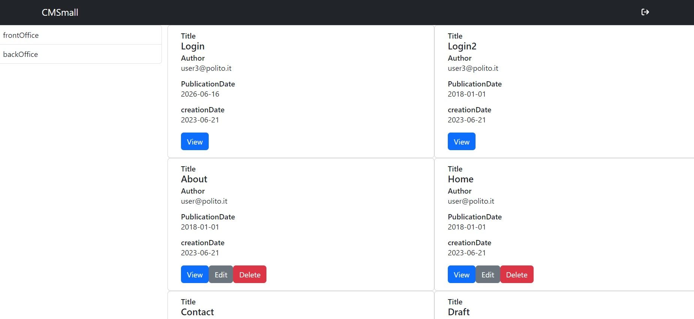
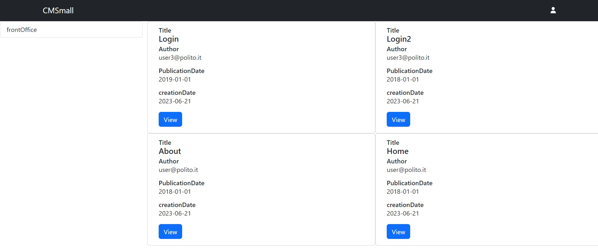
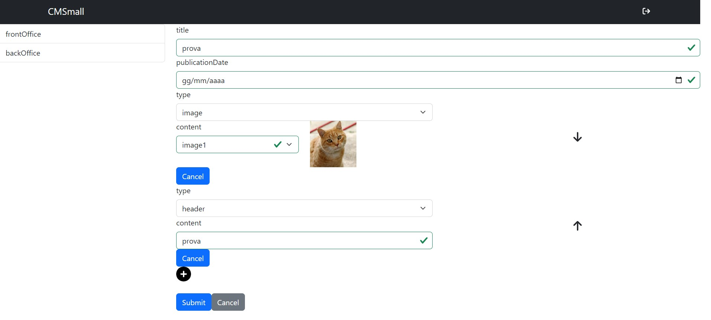

# Exam #1: "CMSmall"

## Student: s308549 Ferrero Michele

# Server side

## API Server

- POST `/api/login`
  - request body:`{
    "username": "admin@polito.it",
    "password": "password"
    }`
  - response body: `{
    "userId": 1,
    "userName": "admin",
    "email": "admin@polito.it",
    "role": "admin"
    }`
- POST `/api/logout`
  - none
  - no response body
- POST `/api/user`
  - cookies
  - response body: `{
    "userId": 1,
    "userName": "admin",
    "email": "admin@polito.it",
    "role": "admin"
    }`
- GET `api/frontOffice`
  - no request parameters
  - `{
    "message": "Pages found",
    "pages": "[{\pageId\":1,\"title\":\"Home\",\"author\":2,\"creationDate\":\"2023-06-21\",\"publicationDate\":\"2018-01-01\",\"authorEmail\":\"user@polito.it\}"
    }`
- GET `api/backOffice`
  - cookies
  - same with also draft and scheduled pages
- GET `/frontOffice/setting/getWebTitle`
  - no request parameters
  - web title
- GET `/frontOffice/page/:pageId/content`
  - different checks done based on publicationDate
  - pageId
  - response body: `{
    "page": {
    "pageId": 5,
    "title": "testPut",
    "author": 4,
    "creationDate": "2023-06-21T18:32:48.000Z",
    "publicationDate": "2018-12-31T23:00:00.000Z",
    "authorEmail": "user3@polito.it"
    },
    "content": [
    {
    "contentId": 9,
    "type": "header",
    "content": "Login",
    "position": 2,
    "pageId": 5
    },
    {
    "contentId": 10,
    "type": "paragraph",
    "content": "Login",
    "position": 1,
    "pageId": 5
    },
    {
    "contentId": 27,
    "type": "image",
    "content": "image1",
    "position": 3,
    "pageId": 5
    }
    ]
    }`
- GET `/backOffice/page/:pageId`
  - used by both front and back office, different checks done based on publicationDate
  - pageId, cookies
  - `{
    "message": "Pages found",
    "pages": {
    "pageId": 5,
    "title": "testPut",
    "author": 4,
    "creationDate": "2023-06-21T18:32:48.000Z",
    "publicationDate": "2018-12-31T23:00:00.000Z",
    "authorEmail": "user3@polito.it"
    }
    }`
- POST `/backOffice/page`
  - cookies, page details, contents
  - create new page and returns a message
- PUT `/backOffice/page/:pageId`
  - cookies, page details
  - update page and returns the response
- DELETE `/backOffice/page/:pageId`
  - cookies
  - delete page and returns the response
- PUT `/backOffice/page/:pageId/author`
  - cookies, authorEmail
  - update page`s author and returns the response
- PUT `/backOffice/setting/setWebTitle`
  - cookies, webTitle
  - update web title and returns the response
- PUT `/backOffice/page/:pageId/content/position`
  - cookies, contentId1, contentId2
  - update content position and returns a message
- GET `/backOffice/page/:pageId/content`
  - cookies
  - get page contents, same format as frontOffice one but with different checks
- GET `/backOffice/page/:pageId/content/:contentId`
  - cookies
  - get page content
- POST `/backOffice/page/:pageId/content`
  - cookies, content details
  - create new content and returns a message
- PUT `/backOffice/page/:pageId/content/:contentId`
  - cookies, content details
  - update content and returns the response
- DELETE `/backOffice/page/:pageId/content/:contentId`
  - cookies
  - delete content and returns the response
- GET `/backOffice/users`
  - cookies
  - response body:`[
    {
    "email": "admin@polito.it"
    },
    {
    "email": "user@polito.it"
    },
    {
    "email": "user2@polito.it"
    },
    {
    "email": "user3@polito.it"
    }
    ]`

## Database Tables

- Table `Users` - contains userId,userName,hash,email,salt,role
- Table `Pages` - contains pageId,title,author,creationDate,publicationDate
- Table `Contents` - contains contentId,pageId,position,type,content
- Table `Settings` - contains settingName,settingValue

# Client side

## React Client Application Routes

- Route `/frontOffice/All`: list of all the frontOffice pages
- Route `/backOffice/All`: list of all the backOffice pages
- Route `/settings`: settings page for the admin
- Route `/login`: login page
- Route `/addPage`: add page
- Route `/editPage/:pageId`: edit page
- Route `/:type/:pageId/:switch`: page view, type stands for editPage or viewPage, pageId is the pageId and switch differences between BO and FO
- Route `editPage/:pageId/editContent/:contentId`: edit content page
- Route `/addContent/:pageId`: add content to page
- Route `/changeAuthor/:pageId`: change page author
- Route `/*`: redirect to /frontOffice/All

## Main React Components

- `App` (in `App.js`): main component, contains the routes
- `CustomLogin`: main component for the login page
- `CustomNavbar`: main component for the navbar (used in MainPage inside App)
- `CustomMenu`: main component for the menu (used in MainPage inside App)
- `Settings`: main component for the settings page for admins
- `FrontOffice`: main component for the frontOffice page
  - `frontOfficeCard`: subcomponent for the frontOffice page - only view redirect
- `BackOffice`: main component for the backOffice page
  - `backOfficeCard`: subcomponent for the backOffice page - view, edit and delete functionalities, also change author for admins
- `viewPage`: main component for viewing a page, it also differs based onf the url between frontOffice and backOffice for functionalities
  - `contentDisplay`: subcomponent for displaying a content
  - `PageDisplay`: subcomponent for displaying page details
- `EditPageFields`: main component for changing page details
- `EditContentFields`: main component for changing content details
- `changeAuthor`: main component for changing page author, admin only feature
- `AddPage`: main component for adding a page
  - `AddContentToPage` : subcomponent for adding a content to a page

# Usage info

## Example Screenshot

## Users Credentials

| Username        | Password | Role  | what it contains            |
|-----------------|----------|-------|-----------------------------|
| user@polito.it  | password | user  | 2 published pages           |
| user2@polito.it | password | user  | nothing                     |
| user3@polito.it | password | user  | 2 pages for each type       |
| admin@polito.it | password | admin | is an admin, no pages owned |
